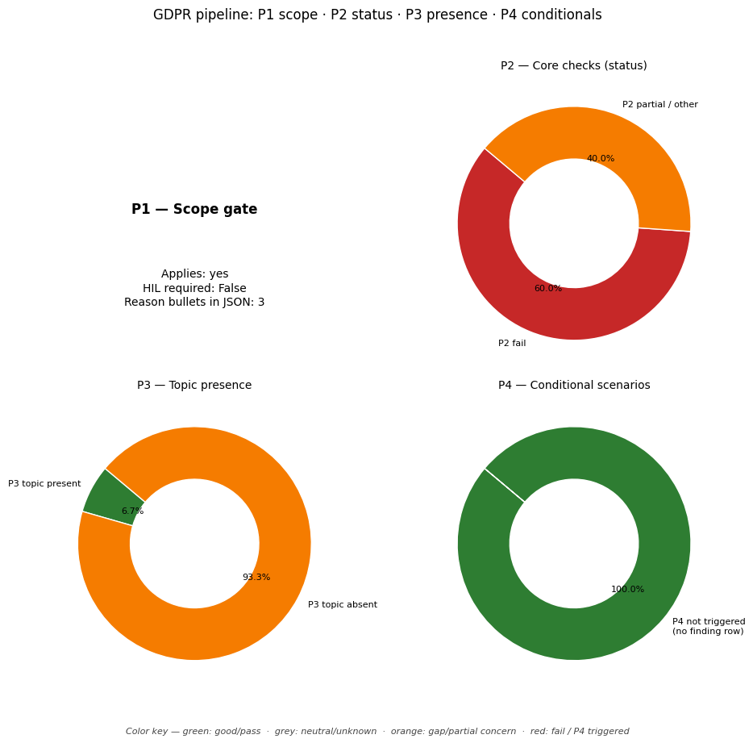

# GDPR Compliance Audit Report

**Target Document:** ../data/testing_files/md_files_pre_gdpr/test1_a1articles.md

## Distribution chart (P1–P4)
*(P1 = scope gate in JSON `scope`; P2–P4 = `findings` by `priority`.)*

## Scope assessment (P1)
Applies: **yes**

HIL required at scope: **False**

### Scope reasons
- The policy mentions 'personal information' and outlines practices for its collection, use, sharing, and security, indicating processing of personal data.
- The policy describes how users can 'amend any information inaccuracies', implying a filing system or structured data processing.
- Although the company's location is not specified, the policy is framed as a 'privacy policy for a1articles' and addresses 'users' consent by accessing A1 Articles, which strongly suggests an offering of goods or services to individuals who are likely in the Union or interacting with a service targeted at them.

## Executive summary
**Overall compliance score (P2-only index):** 20%

### Summary block (`summary` in JSON)
- **findings_total:** 40
- **hil_queue_total:** 15
- **overall_score_pct:** 20
- **p2_findings_total:** 25
- **p2_score:** 0.2
- **p3_findings_total:** 15
- **p4_articles_not_triggered:** 6
- **p4_triggered_total:** 0

### Counts used in the chart
- **P2:** total 25 — fail / partial / pass / other: 15 / 10 / 0 / 0
- **P3:** total 15 — topic present / absent / unknown: 1 / 14 / 0
- **P4:** triggered (summary) 0, triggered rows in `findings` 0, not triggered in scope 6
- **HIL queue items:** 15

## Findings breakdown (P2 / P3 / P4)

### Article 5: Principles relating to processing
- **Priority:** P2
- **Chapter:** Ch.2 – Principles
- **Risk level:** MEDIUM
- **Status:** PARTIAL

#### Identified gaps
* Accountability (Article 5(2))

_Notes:_ The policy addresses lawfulness, fairness, transparency, purpose limitation, data minimisation, accuracy, and storage limitation. However, accountability is not explicitly mentioned or demonstrated.

---

### Article 6: Lawfulness of processing
- **Priority:** P2
- **Chapter:** Ch.2 – Principles
- **Risk level:** CRITICAL
- **Status:** FAIL

#### Identified gaps
* No lawful basis identified for processing activities.

_Notes:_ The policy does not state any lawful basis for processing personal data as required by GDPR Article 6. The policy mentions user consent, but this is not elaborated as a lawful basis for specific processing activities. Therefore, it is a critical gap.

---

### Article 7: Conditions for consent
- **Priority:** P2
- **Chapter:** Ch.2 – Principles
- **Risk level:** HIGH
- **Status:** PARTIAL

#### Identified gaps
* The policy does not mention if consent is required for processing of personal data.
* The policy does not explain how to withdraw consent.
* The policy does not specify that consent must be freely given, specific, informed, and unambiguous.
* The policy does not specify if consent is required for processing of personal data that is not necessary for the performance of a contract.

_Notes:_ The policy mentions that users provide consent by accessing the site, but it does not detail the requirements for consent to be considered valid under GDPR (freely given, specific, informed, unambiguous). There is no information on how consent can be withdrawn, nor any indication if consent is a condition for services. Therefore, this constitutes a partial compliance with Article 7.

---

### Article 8: Child's consent
- **Priority:** P3
- **Chapter:** Ch.2 – Principles
- **Policy present:** False
- **Risk level:** NONE
- **Status:** N/A (P3/P4 OR UNSCORED)

_Notes:_ The policy does not mention age thresholds or parental consent. It is from before GDPR.

---

### Article 9: Special category data
- **Priority:** P2
- **Chapter:** Ch.2 – Principles
- **Risk level:** CRITICAL
- **Status:** PARTIAL

#### Identified gaps
* No mention of explicit consent or derogations for processing of special category data.

_Notes:_ The policy does not address the collection or processing of special category data as defined by Article 9 of the GDPR. Therefore, it's impossible to verify if explicit consent or any of the Article 9(2) derogations are obtained or applied for such data.

---

### Article 10: Criminal convictions data
- **Priority:** P3
- **Chapter:** Ch.2 – Principles
- **Policy present:** False
- **Risk level:** NONE
- **Status:** N/A (P3/P4 OR UNSCORED)

_Notes:_ The policy does not mention criminal convictions data.

---

### Article 11: Processing without identification
- **Priority:** P2
- **Chapter:** Ch.2 – Principles
- **Risk level:** LOW
- **Status:** PARTIAL

#### Identified gaps
* The policy does not explicitly state whether the company processes data without the need for identification. There is no mention of anonymisation or pseudonymisation techniques being employed.
* The policy does not address the conditions under which identification of a data subject might not be required or how the company handles situations where identification is not necessary for the stated purposes of processing.

_Notes:_ The policy mentions that IP addresses are not linked to personal information, which could be interpreted as a form of anonymisation for analytical purposes. However, it does not explicitly address the broader requirements of Article 11, such as processing without identification when purposes do not require it, or the inability to identify a data subject and the corresponding notification requirements. Therefore, compliance is partial.

---

### Article 12: Transparency & modalities
- **Priority:** P2
- **Chapter:** Ch.3 – Rights of data subjects
- **Risk level:** HIGH
- **Status:** FAIL

#### Identified gaps
* The policy does not state that information will be provided in a concise, transparent, intelligible and easily accessible form, using clear and plain language.
* The policy does not state that information will be provided in writing, or by other means, including, where appropriate, by electronic means.
* The policy does not mention the commitment to provide information on action taken on a request within one month of receipt, with the possibility of a two-month extension for complex cases.
* The policy does not mention that information and actions taken regarding data subject rights will be provided free of charge, unless requests are manifestly unfounded or excessive.

_Notes:_ The policy does not mention the 1-month response commitment (extendable by 2 months), provision of information in a concise, transparent, intelligible, and easily accessible form using clear and plain language, provision of information via electronic means (unless otherwise requested), or that information and actions related to data subject rights are to be provided free of charge. Therefore, compliance is not demonstrated.

---

### Article 13: Info collected from data subject
- **Priority:** P2
- **Chapter:** Ch.3 – Rights of data subjects
- **Risk level:** CRITICAL
- **Status:** FAIL

#### Identified gaps
* Identity and contact details of the controller.
* Contact details of the DPO (if applicable).
* The purposes of the processing and the legal basis for the processing.
* The legitimate interests pursued by the controller or by a third party (if processing is based on legitimate interests).
* The recipients or categories of recipients of the personal data.
* Information about transfers of personal data to third countries or international organisations (if applicable).
* The period for which the personal data will be stored, or the criteria used to determine that period.
* The existence of the right to request access to, rectification, erasure, restriction of processing, or objection to processing, and the right to data portability.
* The existence of the right to withdraw consent at any time (if processing is based on consent).
* The right to lodge a complaint with a supervisory authority.
* Whether the provision of personal data is a statutory or contractual requirement or necessary to enter into a contract, and the consequences of failure to provide the data.
* The existence of automated decision-making, including profiling, and meaningful information about the logic involved and envisaged consequences (if applicable).

_Notes:_ The policy mentions some aspects of Article 13 (like types of information collected, purpose of collection, and who it might be shared with), but it is missing many key elements required by Article 13, such as controller identity, DPO contact, legal basis, retention periods, data subject rights, and information on automated decision-making. The policy also seems to be from 2017, predating GDPR.

---

### Article 14: Info not obtained from data subject
- **Priority:** P2
- **Chapter:** Ch.3 – Rights of data subjects
- **Risk level:** MEDIUM
- **Status:** PARTIAL

#### Identified gaps
* The policy does not specify the contact details of the data protection officer, if applicable.
* The policy does not explicitly state the source of personal data if it is not obtained directly from the data subject.
* The policy does not mention whether the personal data is obtained from publicly accessible sources.
* The policy does not provide information on automated decision-making, including profiling, or meaningful information about the logic involved, its significance, and envisaged consequences.

_Notes:_ The policy mentions "third party personal information" is collected, triggering Article 14. However, it does not explicitly detail all the required information under Article 14(1) and 14(2) regarding the source of the data, DPO contact details, or automated decision-making. The policy does state how to amend inaccuracies and security procedures, but lacks clarity on other Article 14 requirements.

---

### Article 15: Right of access
- **Priority:** P2
- **Chapter:** Ch.3 – Rights of data subjects
- **Risk level:** HIGH
- **Status:** FAIL

#### Identified gaps
* The policy does not describe the process for submitting a Subject Access Request (SAR).
* The policy does not specify a response timeline for SARs.
* The policy does not mention identity verification procedures for SARs.
* The policy does not detail what information will be provided to the data subject upon receipt of an SAR.

_Notes:_ The policy mentions that users can be notified regarding various aspects of data collection and use, and how to amend inaccuracies, but it does not outline a clear process for individuals to formally request access to their data (SAR), nor does it specify response times, identity verification, or the scope of information provided, which are key components of GDPR Article 15.

---

### Article 16: Right to rectification
- **Priority:** P2
- **Chapter:** Ch.3 – Rights of data subjects
- **Risk level:** LOW
- **Status:** PARTIAL

#### Identified gaps
* The policy does not specify that rectification must be done 'without undue delay'.

_Notes:_ The policy mentions that users can amend inaccuracies, which covers the right to rectification. However, it does not specify the timeframe of 'without undue delay' as required by GDPR Article 16.

---

### Article 17: Right to erasure
- **Priority:** P2
- **Chapter:** Ch.3 – Rights of data subjects
- **Risk level:** HIGH
- **Status:** FAIL

#### Identified gaps
* The policy does not describe the process for handling data deletion requests.
* The policy does not specify grounds for refusal of deletion requests.
* The policy does not mention any exceptions to the right to erasure, such as retention requirements.
* There is no information on how data subjects can initiate a deletion request.

_Notes:_ The policy is a pre-GDPR privacy policy from 2017 and lacks specific information required by GDPR Article 17, including the process for deletion requests, grounds for refusal, and any retention exceptions. Therefore, the compliance status is 'fail'.

---

### Article 18: Right to restriction
- **Priority:** P2
- **Chapter:** Ch.3 – Rights of data subjects
- **Risk level:** HIGH
- **Status:** FAIL

#### Identified gaps
* The policy does not describe the right to restrict processing of personal data.

_Notes:_ The company policy does not mention or describe the data subject's right to restriction of processing as outlined in GDPR Article 18.

---

### Article 19: Notification on rectification/erasure
- **Priority:** P3
- **Chapter:** Ch.3 – Rights of data subjects
- **Policy present:** False
- **Risk level:** NONE
- **Status:** N/A (P3/P4 OR UNSCORED)

_Notes:_ The policy does not mention downstream notification to recipients in relation to rectification or erasure of personal data. The closest it comes is a general promise to notify authors regarding information collection and use, and changes to the privacy policy.

---

### Article 20: Right to data portability
- **Priority:** P2
- **Chapter:** Ch.3 – Rights of data subjects
- **Risk level:** HIGH
- **Status:** FAIL

#### Identified gaps
* The policy does not mention the right to receive personal data in a structured, commonly used, and machine-readable format.
* The policy does not mention the right to transmit personal data to another controller.
* The policy does not mention the controller-to-controller transfer right.

_Notes:_ The policy is very old (2017) and does not cover the requirements of GDPR Article 20. There is no mention of the right to data portability, including the requirement for data to be in a structured, commonly used, and machine-readable format, nor the right to transmit data to another controller.

---

### Article 21: Right to object
- **Priority:** P2
- **Chapter:** Ch.3 – Rights of data subjects
- **Risk level:** HIGH
- **Status:** FAIL

#### Identified gaps
* The policy does not explicitly mention the right to object to processing for direct marketing or profiling purposes.
* There is no information on how data subjects can exercise this right, particularly through automated means as required by Article 21(5).
* The policy does not state that the right to object will be brought to the attention of the data subject explicitly and separately at the time of the first communication.

_Notes:_ The provided policy text predates GDPR and does not contain any information related to the right to object, direct marketing opt-outs, or profiling objections. Therefore, compliance cannot be verified for Article 21.

---

### Article 22: Automated decision-making
- **Priority:** P2
- **Chapter:** Ch.3 – Rights of data subjects
- **Risk level:** CRITICAL
- **Status:** FAIL

#### Identified gaps
* The company policy does not mention whether decisions are made solely based on automated processing, including profiling, and if such decisions produce legal or similarly significant effects on individuals.
* The company policy does not specify if there are any exceptions to the right not to be subject to automated decision-making, such as necessity for contract performance, authorization by law, or explicit consent.
* There is no mention of safeguards for data subjects' rights and freedoms in cases where automated decisions are made, particularly regarding the right to obtain human intervention, express a point of view, or contest a decision.
* The policy does not address the specific conditions for automated decisions involving special categories of personal data, including necessary safeguards.

_Notes:_ The provided policy text does not contain any information related to Article 22 of the GDPR, which covers automated decision-making and profiling. Therefore, it is impossible to verify compliance with the requirements for disclosure, human review, and the right to contest automated decisions.

---

### Article 24: Responsibility of the controller
- **Priority:** P2
- **Chapter:** Ch.4 – Controller & processor
- **Risk level:** CRITICAL
- **Status:** FAIL

#### Identified gaps
* No policy found that describes the implementation of appropriate technical and organisational measures to ensure and demonstrate GDPR compliance.
* No policy found that outlines the review and updating of data protection measures.
* No policy found that explicitly mentions the implementation of data protection policies as required by GDPR Article 24(2).

_Notes:_ The provided policy text is from before GDPR came into effect and does not address the specific requirements of Article 24 regarding the implementation and demonstration of appropriate technical and organisational measures, nor the implementation of data protection policies. Therefore, compliance cannot be demonstrated.

---

### Article 25: Privacy by design and default
- **Priority:** P3
- **Chapter:** Ch.4 – Controller & processor
- **Policy present:** False
- **Risk level:** NONE
- **Status:** N/A (P3/P4 OR UNSCORED)

_Notes:_ The policy does not mention privacy by design or privacy by default. The closest it comes is a mention of 'security procedures are in place in order to eliminate the potential loss, misuse or alteration of your information', but this is a general statement and does not specifically address the proactive design or default settings required by Article 25.

---

### Article 26: Joint controllers
- **Priority:** P3
- **Chapter:** Ch.4 – Controller & processor
- **Policy present:** False
- **Risk level:** NONE
- **Status:** N/A (P3/P4 OR UNSCORED)

_Notes:_ The policy excerpt does not mention joint controllership or any arrangement where multiple entities determine the purposes and means of processing personal data. It only states that 'Submit articles or find free articles are the sole owner of the information which is collected on A1 Articles.'

---

### Article 27: Representatives (non-EU)
- **Priority:** P3
- **Chapter:** Ch.4 – Controller & processor
- **Policy present:** False
- **Risk level:** NONE
- **Status:** N/A (P3/P4 OR UNSCORED)

_Notes:_ The provided text is from before the GDPR implementation. It does not contain any information related to Article 27, which concerns representatives for non-EU entities.

---

### Article 28: Processor / DPA
- **Priority:** P2
- **Chapter:** Ch.4 – Controller & processor
- **Risk level:** CRITICAL
- **Status:** FAIL

#### Identified gaps
* The policy does not contain clauses for a Data Processing Agreement (DPA) as required by GDPR Article 28.
* There is no mention of a sub-processor list or the controller's right to be informed about changes to it.
* The policy lacks provisions regarding audit rights for the controller to verify the processor's compliance.
* There are no explicit obligations for the processor to delete or return personal data after service provision.
* The policy does not specify that data processing must follow the controller's documented instructions.

_Notes:_ The provided policy text is from 2017 and predates GDPR. It does not contain any of the required clauses for a Data Processing Agreement (DPA) under Article 28, such as sub-processor lists, audit rights, deletion/return obligations, or processing based on documented instructions. Therefore, the compliance status is 'fail' with a 'critical' risk.

---

### Article 29: Processing under authority
- **Priority:** P2
- **Chapter:** Ch.4 – Controller & processor
- **Risk level:** MEDIUM
- **Status:** PARTIAL

#### Identified gaps
* The policy does not specify if processing is done only on instructions from the controller, unless required by law.

_Notes:_ The policy mentions that 'Submit articles or find free articles are the sole owner of the information which is collected on A1 Articles' and 'your information will only be used for the reasons stipulated on this page.' This implies instructions but does not explicitly state that processing is done solely on instructions from the controller.

---

### Article 30: Records of processing (ROPA)
- **Priority:** P2
- **Chapter:** Ch.4 – Controller & processor
- **Risk level:** CRITICAL
- **Status:** FAIL

#### Identified gaps
* Record of processing activities (ROPA) not found.
* Purposes of processing not documented.
* Categories of data subjects not documented.
* Categories of personal data not documented.
* Categories of recipients not documented.
* Retention periods for personal data not documented.
* Security measures not documented.

_Notes:_ The company policy does not contain any information regarding a Record of Processing Activities (ROPA). Therefore, it's not possible to assess whether it covers the required elements such as purposes, categories of data subjects and data, recipients, retention periods, and security measures. The absence of a ROPA is a critical compliance gap under GDPR Article 30.

---

### Article 32: Security of processing
- **Priority:** P3
- **Chapter:** Ch.4 – Controller & processor
- **Policy present:** True
- **Risk level:** NONE
- **Status:** N/A (P3/P4 OR UNSCORED)

_Notes:_ The policy mentions "security procedures" in place to prevent loss, misuse, or alteration of information. This is a direct reference to the topic of security of processing, aligning with Article 32's requirements for technical and organisational measures.

---

### Article 33: Breach notification to SA
- **Priority:** P3
- **Chapter:** Ch.4 – Controller & processor
- **Policy present:** False
- **Risk level:** NONE
- **Status:** N/A (P3/P4 OR UNSCORED)

_Notes:_ The provided text does not contain information regarding breach notification to a supervisory authority or the operational breach log. The policy is pre-GDPR and focuses on general privacy promises and data collection practices.

---

### Article 34: Breach communication to data subject
- **Priority:** P3
- **Chapter:** Ch.4 – Controller & processor
- **Policy present:** False
- **Risk level:** NONE
- **Status:** N/A (P3/P4 OR UNSCORED)

_Notes:_ The policy excerpt is pre-GDPR and does not mention data breaches or breach communication to data subjects. It focuses on general privacy practices like data collection, use, sharing, and security procedures. Article 34 of GDPR specifically deals with the communication of personal data breaches to data subjects, a topic not covered in the provided text.

---

### Article 35: DPIA
- **Priority:** P3
- **Chapter:** Ch.4 – Controller & processor
- **Policy present:** False
- **Risk level:** NONE
- **Status:** N/A (P3/P4 OR UNSCORED)

_Notes:_ The policy excerpt does not mention Data Protection Impact Assessments (DPIAs) or any related concepts like risk assessments for processing personal data.

---

### Article 37: DPO designation
- **Priority:** P2
- **Chapter:** Ch.4 – Controller & processor
- **Risk level:** HIGH
- **Status:** PARTIAL

#### Identified gaps
* The policy does not specify if the company is a public authority or body.
* The policy does not provide information on whether the core activities involve regular and systematic monitoring of data subjects on a large scale.
* The policy does not mention the processing of special categories of data or data relating to criminal convictions and offences on a large scale.
* The policy does not publish the contact details of a Data Protection Officer (DPO).
* The policy does not state if a DPO has been appointed.

_Notes:_ The provided policy text is from 2017 and does not contain sufficient information to determine if a DPO is required under GDPR Article 37. Specifically, it does not address whether the company is a public authority, conducts large-scale monitoring, or processes special categories of data. Furthermore, there is no mention of a DPO's contact details being published.

---

### Article 38: DPO position
- **Priority:** P3
- **Chapter:** Ch.4 – Controller & processor
- **Policy present:** False
- **Risk level:** NONE
- **Status:** N/A (P3/P4 OR UNSCORED)

_Notes:_ The provided policy text focuses on general privacy policy information (data collection, use, sharing, security, user consent) and does not contain any specific language related to the position or independence of a Data Protection Officer (DPO) as required by Article 38 of the GDPR. The policy is also pre-GDPR, which further explains the lack of relevant content.

---

### Article 39: DPO tasks
- **Priority:** P2
- **Chapter:** Ch.4 – Controller & processor
- **Risk level:** CRITICAL
- **Status:** FAIL

#### Identified gaps
* DPO mandate not specified in policy
* No information on DPO tasks: advise controller/processor/employees on data protection obligations
* No information on DPO tasks: monitor compliance with data protection regulations and internal policies
* No information on DPO tasks: provide advice on data protection impact assessments (DPIAs) and monitor their performance
* No information on DPO tasks: cooperate with supervisory authorities
* No mention of DPO role as a contact point for supervisory authorities
* No information on DPO's duty to consider processing risks

_Notes:_ The policy is from 2017 and does not contain any information about the role or tasks of a Data Protection Officer (DPO) as required by GDPR Article 39. Therefore, it is impossible to verify if the DPO mandate covers advising, monitoring compliance, DPIA involvement, or cooperation with supervisory authorities.

---

### Article 40: Codes of conduct
- **Priority:** P3
- **Chapter:** Ch.4 – Controller & processor
- **Policy present:** False
- **Risk level:** NONE
- **Status:** N/A (P3/P4 OR UNSCORED)

_Notes:_ Article 40 of the GDPR concerns codes of conduct, which are approved by supervisory authorities to ensure compliance with data protection regulations. The provided policy text is a general privacy policy from 2017, focusing on basic privacy promises, information collection, use, cookies, log files, and external links. It does not mention or address codes of conduct, their creation, approval, or adherence to them in any substantive way.

---

### Article 42: Certification
- **Priority:** P3
- **Chapter:** Ch.4 – Controller & processor
- **Policy present:** False
- **Risk level:** NONE
- **Status:** N/A (P3/P4 OR UNSCORED)

_Notes:_ The provided policy text does not mention or address certification claims, their verification, or any related processes.

---

### Article 44: General principle for transfers
- **Priority:** P2
- **Chapter:** Ch.5 – Transfers to third countries
- **Risk level:** HIGH
- **Status:** PARTIAL

#### Identified gaps
* The policy does not mention any mechanisms for international data transfers.
* There is no information regarding compliance with Chapter V of the GDPR for international transfers.

_Notes:_ The policy is pre-GDPR and does not address international data transfers as required by Article 44. There is no mention of Chapter V mechanisms. Therefore, compliance cannot be confirmed.

---

### Article 45: Adequacy decision transfers
- **Priority:** P2
- **Chapter:** Ch.5 – Transfers to third countries
- **Risk level:** CRITICAL
- **Status:** FAIL

#### Identified gaps
* The policy does not mention adequacy decisions for international data transfers, nor does it specify any countries or jurisdictions that are considered adequate for data transfers under Article 45 of the GDPR. There is no information on mechanisms or safeguards employed for such transfers.

_Notes:_ The provided policy text predates the GDPR and does not contain any information relevant to Article 45, which deals with international data transfers based on adequacy decisions. There is no mention of data transfer mechanisms or adequacy assessments.

---

### Article 46: Transfers with safeguards
- **Priority:** P3
- **Chapter:** Ch.5 – Transfers to third countries
- **Policy present:** False
- **Risk level:** NONE
- **Status:** N/A (P3/P4 OR UNSCORED)

_Notes:_ The provided text is from a privacy policy archived before GDPR came into effect and does not mention Article 46 topics such as safeguards for international data transfers, SCCs, or BCRs.

---

### Article 47: Binding corporate rules
- **Priority:** P3
- **Chapter:** Ch.5 – Transfers to third countries
- **Policy present:** False
- **Risk level:** NONE
- **Status:** N/A (P3/P4 OR UNSCORED)

_Notes:_ The policy does not mention binding corporate rules or anything related to GDPR Article 47.

---

### Article 77: Right to lodge a complaint
- **Priority:** P2
- **Chapter:** Ch.8 – Remedies, liability & penalties
- **Risk level:** HIGH
- **Status:** FAIL

#### Identified gaps
* Policy does not inform data subjects of their right to lodge a complaint with a supervisory authority.
* Policy does not inform data subjects on how to lodge a complaint with a supervisory authority.

_Notes:_ The policy does not inform data subjects of their right to lodge a complaint with a supervisory authority, nor does it provide information on how to do so. This is a direct violation of GDPR Article 77(1) and (2).

---

### Article 88: Employment context
- **Priority:** P2
- **Chapter:** Ch.9 – Specific processing situations
- **Risk level:** MEDIUM
- **Status:** PARTIAL

#### Identified gaps
* recruitment
* performance of the contract of employment
* management, planning and organisation of work
* equality and diversity in the workplace
* health and safety at work
* protection of employer's or customer's property
* exercise and enjoyment of rights and benefits related to employment
* termination of the employment relationship

_Notes:_ The policy covers general privacy notice requirements but does not specifically address the employment context as required by Article 88. Therefore, it fails to cover specific aspects like recruitment, contract performance, work organization, health and safety, protection of property, employment benefits, and termination.

---

## Human-in-the-loop (HIL) review queue

**1. Article 8: Child's consent**
- Type: p3_verify
- Notes: The policy does not mention age thresholds or parental consent. It is from before GDPR.

**2. Article 10: Criminal convictions data**
- Type: p3_verify
- Notes: The policy does not mention criminal convictions data.

**3. Article 19: Notification on rectification/erasure**
- Type: p3_verify
- Notes: The policy does not mention downstream notification to recipients in relation to rectification or erasure of personal data. The closest it comes is a general promise to notify authors regarding information collection and use, and changes to the privacy policy.

**4. Article 25: Privacy by design and default**
- Type: p3_verify
- Notes: The policy does not mention privacy by design or privacy by default. The closest it comes is a mention of 'security procedures are in place in order to eliminate the potential loss, misuse or alteration of your information', but this is a general statement and does not specifically address the proactive design or default settings required by Article 25.

**5. Article 26: Joint controllers**
- Type: p3_verify
- Notes: The policy excerpt does not mention joint controllership or any arrangement where multiple entities determine the purposes and means of processing personal data. It only states that 'Submit articles or find free articles are the sole owner of the information which is collected on A1 Articles.'

**6. Article 27: Representatives (non-EU)**
- Type: p3_verify
- Notes: The provided text is from before the GDPR implementation. It does not contain any information related to Article 27, which concerns representatives for non-EU entities.

**7. Article 32: Security of processing**
- Type: p3_verify
- Notes: The policy mentions "security procedures" in place to prevent loss, misuse, or alteration of information. This is a direct reference to the topic of security of processing, aligning with Article 32's requirements for technical and organisational measures.

**8. Article 33: Breach notification to SA**
- Type: p3_verify
- Notes: The provided text does not contain information regarding breach notification to a supervisory authority or the operational breach log. The policy is pre-GDPR and focuses on general privacy promises and data collection practices.

**9. Article 34: Breach communication to data subject**
- Type: p3_verify
- Notes: The policy excerpt is pre-GDPR and does not mention data breaches or breach communication to data subjects. It focuses on general privacy practices like data collection, use, sharing, and security procedures. Article 34 of GDPR specifically deals with the communication of personal data breaches to data subjects, a topic not covered in the provided text.

**10. Article 35: DPIA**
- Type: p3_verify
- Notes: The policy excerpt does not mention Data Protection Impact Assessments (DPIAs) or any related concepts like risk assessments for processing personal data.

**11. Article 38: DPO position**
- Type: p3_verify
- Notes: The provided policy text focuses on general privacy policy information (data collection, use, sharing, security, user consent) and does not contain any specific language related to the position or independence of a Data Protection Officer (DPO) as required by Article 38 of the GDPR. The policy is also pre-GDPR, which further explains the lack of relevant content.

**12. Article 40: Codes of conduct**
- Type: p3_verify
- Notes: Article 40 of the GDPR concerns codes of conduct, which are approved by supervisory authorities to ensure compliance with data protection regulations. The provided policy text is a general privacy policy from 2017, focusing on basic privacy promises, information collection, use, cookies, log files, and external links. It does not mention or address codes of conduct, their creation, approval, or adherence to them in any substantive way.

**13. Article 42: Certification**
- Type: p3_verify
- Notes: The provided policy text does not mention or address certification claims, their verification, or any related processes.

**14. Article 46: Transfers with safeguards**
- Type: p3_verify
- Notes: The provided text is from a privacy policy archived before GDPR came into effect and does not mention Article 46 topics such as safeguards for international data transfers, SCCs, or BCRs.

**15. Article 47: Binding corporate rules**
- Type: p3_verify
- Notes: The policy does not mention binding corporate rules or anything related to GDPR Article 47.

