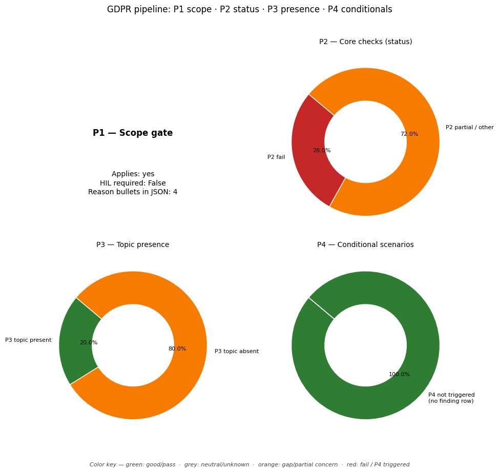

# GDPR Compliance Audit Report

**Target Document:** ../data/testing_files/md_files_post_gdpr/test2_NYtimes.md

## Distribution chart (P1–P4)
*(P1 = scope gate in JSON `scope`; P2–P4 = `findings` by `priority`.)*

## Scope assessment (P1)
Applies: **yes**

HIL required at scope: **False**

### Scope reasons
- The company collects personal data (e.g., contact information, account credentials, payment information) for various services like subscriptions and event registrations.
- The policy indicates that the data collected is personal information that can identify the user, falling under the definition of personal data in GDPR.
- The policy mentions offering services and processing payments, which suggests commercial activities that are within the material scope of GDPR.
- Although not explicitly stated, the New York Times is a widely accessible service, making it probable that it targets or monitors users within the Union, bringing it under the territorial scope of GDPR Art. 3(2).

## Executive summary
**Overall compliance score (P2-only index):** 36%

### Summary block (`summary` in JSON)
- **findings_total:** 40
- **hil_queue_total:** 15
- **overall_score_pct:** 36
- **p2_findings_total:** 25
- **p2_score:** 0.36
- **p3_findings_total:** 15
- **p4_articles_not_triggered:** 6
- **p4_triggered_total:** 0

### Counts used in the chart
- **P2:** total 25 — fail / partial / pass / other: 7 / 18 / 0 / 0
- **P3:** total 15 — topic present / absent / unknown: 3 / 12 / 0
- **P4:** triggered (summary) 0, triggered rows in `findings` 0, not triggered in scope 6
- **HIL queue items:** 15

## Findings breakdown (P2 / P3 / P4)

### Article 5: Principles relating to processing
- **Priority:** P2
- **Chapter:** Ch.2 – Principles
- **Risk level:** MEDIUM
- **Status:** PARTIAL

#### Identified gaps
* lawfulness, fairness and transparency
* accuracy
* storage limitation
* accountability

_Notes:_ The policy touches upon several of the principles of GDPR Article 5, including purpose limitation (collecting data for specified purposes), data minimisation (collecting information based on context and necessity), and transparency (explaining data collection and usage). However, there is no explicit mention of lawfulness, fairness, accuracy, storage limitation, or accountability. For example, it is not clear how the company ensures data accuracy or has policies for data deletion/retention (storage limitation). The policy also does not detail how the company demonstrates accountability for data processing.

---

### Article 6: Lawfulness of processing
- **Priority:** P2
- **Chapter:** Ch.2 – Principles
- **Risk level:** CRITICAL
- **Status:** PARTIAL

#### Identified gaps
* No lawful basis is stated for the collection and processing of personal data.

_Notes:_ The policy does not explicitly state the lawful basis for processing personal data as required by GDPR Article 6. Therefore, it is not possible to determine if the processing activities described are lawful. For example, when users sign up for a Times Service, their contact information and account credentials are collected, but the basis for this processing is not mentioned.

---

### Article 7: Conditions for consent
- **Priority:** P2
- **Chapter:** Ch.2 – Principles
- **Risk level:** MEDIUM
- **Status:** PARTIAL

#### Identified gaps
* The policy does not explicitly state that consent must be 'freely given' and that the performance of a contract cannot be conditional on consent to processing not necessary for that contract.
* The policy does not explicitly state that consent must be 'unambiguous'.
* The policy does not explicitly state that consent must be 'informed' prior to giving consent.

_Notes:_ The policy mentions options to opt-out of marketing communications, which relates to withdrawing consent. It also discusses specificity in requests regarding personal information. However, it does not explicitly detail the requirements for consent to be 'freely given', 'specific', 'informed', or 'unambiguous' as per GDPR Article 7. The policy implies that some actions might be conditional on providing information (e.g., completing a purchase), but it's unclear if this relates to consent for processing data not necessary for the transaction itself.

---

### Article 8: Child's consent
- **Priority:** P3
- **Chapter:** Ch.2 – Principles
- **Policy present:** True
- **Risk level:** NONE
- **Status:** N/A (P3/P4 OR UNSCORED)

_Notes:_ The policy states that services are not directed at children under 13 and that they do not knowingly gather personal information in a manner not permitted by COPPA. It also provides a contact for parents to report potential violations and states that data will be removed if required by law.

---

### Article 9: Special category data
- **Priority:** P2
- **Chapter:** Ch.2 – Principles
- **Risk level:** MEDIUM
- **Status:** PARTIAL

#### Identified gaps
* Policy does not specify how explicit consent or Art.9(2) derogation is obtained or verified for sensitive data, only that sensitive data is generally not wanted and may be declined in surveys.

_Notes:_ The policy states that sensitive information is generally not wanted and users can decline to answer in rare situations like surveys. However, it does not detail the process for obtaining explicit consent or verifying Art.9(2) derogations when such data is processed. This creates a gap in compliance regarding the lawful processing of special category data as defined by GDPR Article 9.

---

### Article 10: Criminal convictions data
- **Priority:** P3
- **Chapter:** Ch.2 – Principles
- **Policy present:** False
- **Risk level:** NONE
- **Status:** N/A (P3/P4 OR UNSCORED)

---

### Article 11: Processing without identification
- **Priority:** P2
- **Chapter:** Ch.2 – Principles
- **Risk level:** LOW
- **Status:** PARTIAL

#### Identified gaps
* The policy does not specify if or how data subjects are informed when their identification is not required and not possible.
* The policy does not mention specific provisions for Article 15-20 rights when identification is not possible.

_Notes:_ The policy mentions assigning a unique ID number once registered and collecting personal information. However, it does not explicitly state whether processing occurs without identification, or if data subjects are informed when their identification is not possible or required for processing purposes, as per Article 11.

---

### Article 12: Transparency & modalities
- **Priority:** P2
- **Chapter:** Ch.3 – Rights of data subjects
- **Risk level:** MEDIUM
- **Status:** PARTIAL

#### Identified gaps
* The policy does not specify a timeframe for responding to data subject requests.
* The policy does not mention providing responses free of charge.
* The policy does not mention providing responses in oral form upon request.
* The policy does not mention providing responses using standardized icons.

_Notes:_ The policy mentions that information is gathered based on context and user interaction, and that users can link or disconnect third-party accounts. However, it does not explicitly state the commitment to provide responses to data subject requests within a month, nor does it mention providing information free of charge or in alternative formats like oral communication or standardized icons. The policy also does not address the process for handling manifestly unfounded or excessive requests.

---

### Article 13: Info collected from data subject
- **Priority:** P2
- **Chapter:** Ch.3 – Rights of data subjects
- **Risk level:** MEDIUM
- **Status:** PARTIAL

#### Identified gaps
* The policy does not mention the identity and contact details of the controller.
* The policy does not mention the contact details of the Data Protection Officer (DPO), if applicable.
* The policy does not explicitly state the legal basis for all processing activities.
* The policy does not provide information on the legitimate interests pursued by the controller or a third party where processing is based on legitimate interests.
* The policy does not clearly outline the recipients or categories of recipients of the personal data.
* The policy does not specify whether the controller intends to transfer personal data to a third country or international organisation and the existence/absence of an adequacy decision or safeguards.
* The policy does not mention the period for which personal data will be stored, or the criteria used to determine that period.
* The policy does not explicitly detail the existence of rights such as the right to data portability.
* The policy does not mention the right to lodge a complaint with a supervisory authority.
* The policy does not specify whether the provision of personal data is a statutory or contractual requirement or a requirement necessary to enter into a contract, nor the possible consequences of failure to provide data.
* The policy does not address the existence of automated decision-making, including profiling, and meaningful information about the logic involved, its significance, and envisaged consequences.

_Notes:_ The policy provides some information about data collection and usage, but lacks details required by GDPR Article 13 regarding controller identification, DPO contact, explicit legal basis for all processing, retention periods, recipients, data transfer information, data subject rights, and automated decision-making. Specific mention of consent withdrawal rights and the right to lodge a complaint with a supervisory authority is also missing. The policy mentions 'service provider' but does not provide details about them as recipients. The policy mentions 'consent' in relation to some data collection activities, but does not detail the right to withdraw consent.

---

### Article 14: Info not obtained from data subject
- **Priority:** P2
- **Chapter:** Ch.3 – Rights of data subjects
- **Risk level:** HIGH
- **Status:** PARTIAL

#### Identified gaps
* The company policy does not specify the identity and contact details of the controller, nor the contact details of the Data Protection Officer (DPO), if applicable.
* The company policy does not explicitly state the purposes of processing for which personal data are intended or the legal basis for the processing, other than implied consent for specific programs.
* The company policy does not detail the categories of recipients or categories of recipients of the personal data.
* The company policy does not mention the controller's intent to transfer personal data to recipients in third countries or international organizations, nor the existence of adequacy decisions or safeguards.
* The company policy does not specify the period for which personal data will be stored, or the criteria used to determine that period.
* The company policy does not explicitly mention the legitimate interests pursued by the controller or a third party, where applicable.
* The company policy does not clearly outline the existence of automated decision-making, including profiling, and meaningful information about the logic involved, its significance, and envisaged consequences.
* The company policy does not state from which source the personal data originate when not obtained directly from the data subject, and if applicable, whether it came from publicly accessible sources.

_Notes:_ The policy mentions obtaining data from third-party sources like 'Marketing, data analytic and social media-owned databases' and through linking social media accounts. However, it lacks specific information required under Article 14(1) and 14(2), such as controller details, DPO contact, explicit purposes and legal basis, categories of recipients, data retention periods, and details on automated decision-making/profiling. The policy does mention that data can come from 'public data' and 'survey data', hinting at Article 14(2)(f), but doesn't clearly state the origin of all data not obtained directly from the subject.

---

### Article 15: Right of access
- **Priority:** P2
- **Chapter:** Ch.3 – Rights of data subjects
- **Risk level:** HIGH
- **Status:** PARTIAL

#### Identified gaps
* The policy does not describe the process for submitting a Subject Access Request (SAR).
* The policy does not specify the timeframe for responding to SARs.
* The policy does not detail the identity verification process for SARs.
* The policy does not explicitly state what information will be provided as part of an SAR response.

_Notes:_ The policy does not describe the process for submitting a Subject Access Request (SAR), the response timeline, identity verification, or the specific information provided to the data subject. This leaves significant gaps in compliance with Article 15.

---

### Article 16: Right to rectification
- **Priority:** P2
- **Chapter:** Ch.3 – Rights of data subjects
- **Risk level:** MEDIUM
- **Status:** PARTIAL

#### Identified gaps
* The policy does not specify that rectification requests must be handled 'without undue delay'.

_Notes:_ The policy describes the right to change, delete, update, or exercise other rights in relation to personal information. It also mentions responding to requests in a manner consistent with applicable law and completing opt-out requests as quickly as possible. However, it does not explicitly state that rectification requests must be handled 'without undue delay', which is a key requirement of GDPR Article 16.

---

### Article 17: Right to erasure
- **Priority:** P2
- **Chapter:** Ch.3 – Rights of data subjects
- **Risk level:** MEDIUM
- **Status:** PARTIAL

#### Identified gaps
* The policy does not explicitly state the grounds for refusing a deletion request.
* The policy does not describe the process for handling deletion requests where the personal data has been made public.
* The policy does not specify exceptions for retention of personal data beyond a deletion request, other than for legal claims.

_Notes:_ The policy describes how to request suppression of information and mentions retention for recordkeeping or transaction completion. However, it does not detail the specific grounds for refusal of a deletion request, nor does it cover the process for public data or other exceptions to erasure beyond legal claims and transaction completion.

---

### Article 18: Right to restriction
- **Priority:** P2
- **Chapter:** Ch.3 – Rights of data subjects
- **Risk level:** MEDIUM
- **Status:** PARTIAL

#### Identified gaps
* The policy does not explicitly mention the right to restrict processing in cases where the accuracy of personal data is contested, or when processing is unlawful and erasure is opposed.

_Notes:_ The policy mentions limitations that users can request on how their personal information is used, which can be interpreted as a form of restriction of processing. However, it does not explicitly cover all the conditions outlined in Article 18, such as restriction due to contested accuracy or unlawful processing where erasure is opposed. It also doesn't specify that the data would be marked for restriction.

---

### Article 19: Notification on rectification/erasure
- **Priority:** P3
- **Chapter:** Ch.3 – Rights of data subjects
- **Policy present:** False
- **Risk level:** NONE
- **Status:** N/A (P3/P4 OR UNSCORED)

_Notes:_ The policy mentions the right to rectify or delete personal information, and that requests will be responded to in a manner consistent with applicable law. However, it does not mention notifying recipients of these changes, which is the core of Article 19.

---

### Article 20: Right to data portability
- **Priority:** P2
- **Chapter:** Ch.3 – Rights of data subjects
- **Risk level:** HIGH
- **Status:** FAIL

#### Identified gaps
* Structured, commonly used, and machine-readable format for data transmission.
* Right to transmit data to another controller without hindrance.
* Controller-to-controller transfer mechanism (where technically feasible).
* Conditions for exercising the right (consent or contract, automated processing).

_Notes:_ The provided policy text does not contain any information regarding the right to data portability, including the format of data, the ability to transmit data to other controllers, or the conditions under which this right applies. Therefore, compliance cannot be verified.

---

### Article 21: Right to object
- **Priority:** P2
- **Chapter:** Ch.3 – Rights of data subjects
- **Risk level:** HIGH
- **Status:** FAIL

#### Identified gaps
* The policy does not explicitly state that individuals have the right to object to the processing of their personal data for direct marketing purposes, nor does it mention that this right includes profiling related to direct marketing.
* The policy does not specify that the right to object must be brought to the attention of the data subject clearly and separately at the time of the first communication, or that it can be exercised through automated means.
* The policy does not describe how individuals can exercise their right to object to direct marketing or profiling.

_Notes:_ The policy does not address the right to object to direct marketing and profiling, which is a requirement under GDPR Article 21. There is no information on how users can opt-out of direct marketing or profiling activities.

---

### Article 22: Automated decision-making
- **Priority:** P2
- **Chapter:** Ch.3 – Rights of data subjects
- **Risk level:** CRITICAL
- **Status:** PARTIAL

#### Identified gaps
* The policy does not explicitly state the right not to be subject to automated decision-making, including profiling, that produces significant legal or similar effects.
* The policy does not mention whether decisions are necessary for contract performance, authorized by law with safeguards, or based on explicit consent.
* The policy does not detail provisions for human intervention, the right to express a point of view, or the right to contest automated decisions when they are based on contract or consent.

_Notes:_ The policy lacks information regarding automated decision-making processes and the rights of data subjects concerning such decisions. There is no mention of Article 22 rights such as the right not to be subject to automated decision-making, the exceptions to this right (contract, legal authorization, consent), or the safeguards required (human intervention, right to contest) when these exceptions apply. Therefore, compliance with GDPR Article 22 cannot be confirmed.

---

### Article 24: Responsibility of the controller
- **Priority:** P2
- **Chapter:** Ch.4 – Controller & processor
- **Risk level:** MEDIUM
- **Status:** PARTIAL

#### Identified gaps
* The policy does not explicitly state that the controller shall implement appropriate technical and organisational measures to ensure and demonstrate compliance with GDPR.
* The policy does not mention reviewing and updating these measures where necessary.
* There is no mention of implementing data protection policies as part of the controller's obligations, as required by Article 24(2) when proportionate.
* The policy does not reference adherence to approved codes of conduct or certification mechanisms as a means to demonstrate compliance.

_Notes:_ The policy outlines various data collection and processing activities but lacks explicit statements regarding the controller's responsibility to implement and demonstrate compliance with GDPR through specific technical and organisational measures, policy implementation, and adherence to codes of conduct or certifications. While some practices like consent for data collection and user control over information might indirectly support compliance, the direct obligations under Article 24 are not clearly articulated or evidenced.

---

### Article 25: Privacy by design and default
- **Priority:** P3
- **Chapter:** Ch.4 – Controller & processor
- **Policy present:** False
- **Risk level:** NONE
- **Status:** N/A (P3/P4 OR UNSCORED)

_Notes:_ The policy does not explicitly mention 'privacy by design' or 'privacy by default'. While it discusses data collection, use, and sharing, and includes sections on user rights and data protection, it does not use the specific terminology or address the principles of Article 25.

---

### Article 26: Joint controllers
- **Priority:** P3
- **Chapter:** Ch.4 – Controller & processor
- **Policy present:** False
- **Risk level:** NONE
- **Status:** N/A (P3/P4 OR UNSCORED)

_Notes:_ The policy does not mention joint controllership.

---

### Article 27: Representatives (non-EU)
- **Priority:** P3
- **Chapter:** Ch.4 – Controller & processor
- **Policy present:** False
- **Risk level:** NONE
- **Status:** N/A (P3/P4 OR UNSCORED)

_Notes:_ The policy does not mention or address the topic of data protection representatives for non-EU entities, nor does it discuss the requirement for a written mandate. The closest it comes is mentioning that the company is headquartered in the US and that data is transferred to the US, but it does not outline any representative roles.

---

### Article 28: Processor / DPA
- **Priority:** P2
- **Chapter:** Ch.4 – Controller & processor
- **Risk level:** HIGH
- **Status:** FAIL

#### Identified gaps
* The policy does not specify the need for a Data Processing Agreement (DPA) that includes clauses on sub-processor lists, audit rights, data deletion/return obligations, and processing based on written instructions. (Article 28(2), 28(3), 28(4), 28(9))

_Notes:_ The provided policy text does not contain any information regarding Data Processing Agreements (DPAs) or specific contractual clauses required by Article 28 of the GDPR. Therefore, it is impossible to verify the presence of sub-processor lists, audit rights, deletion/return obligations, or processing based on written instructions. This lack of documented agreements with processors represents a significant compliance gap.

---

### Article 29: Processing under authority
- **Priority:** P2
- **Chapter:** Ch.4 – Controller & processor
- **Risk level:** MEDIUM
- **Status:** PARTIAL

#### Identified gaps
* Instructions for processing personal data are not explicitly documented as required by Article 29.

_Notes:_ The policy does not contain information regarding the instructions given to processors or individuals acting under the authority of the controller or processor. Therefore, it is not possible to verify compliance with Article 29 of the GDPR, which states that such processing should only occur based on the controller's instructions, unless required by law.

---

### Article 30: Records of processing (ROPA)
- **Priority:** P2
- **Chapter:** Ch.4 – Controller & processor
- **Risk level:** CRITICAL
- **Status:** FAIL

#### Identified gaps
* No record of processing activities (ROPA) identified.
* Purposes of processing not documented.
* Categories of data subjects not documented.
* Categories of personal data not documented.
* Categories of recipients not documented.
* Information on data transfers to third countries or international organisations not documented.
* Time limits for erasure of data categories not documented.
* Description of technical and organisational security measures not documented.

_Notes:_ The company policy does not contain any information about a record of processing activities (ROPA). Therefore, it is not possible to verify if it covers the required elements such as purposes, categories of data subjects and data, recipients, transfers, retention periods, and security measures.

---

### Article 32: Security of processing
- **Priority:** P3
- **Chapter:** Ch.4 – Controller & processor
- **Policy present:** True
- **Risk level:** NONE
- **Status:** N/A (P3/P4 OR UNSCORED)

---

### Article 33: Breach notification to SA
- **Priority:** P3
- **Chapter:** Ch.4 – Controller & processor
- **Policy present:** False
- **Risk level:** NONE
- **Status:** N/A (P3/P4 OR UNSCORED)

_Notes:_ The policy does not contain information regarding breach notification to a supervisory authority within 72 hours, nor does it mention a Data Protection Officer's contact details in relation to such notifications. There is also no mention of an operational breach log.

---

### Article 34: Breach communication to data subject
- **Priority:** P3
- **Chapter:** Ch.4 – Controller & processor
- **Policy present:** False
- **Risk level:** NONE
- **Status:** N/A (P3/P4 OR UNSCORED)

_Notes:_ The policy excerpt does not contain any information about breach communication to data subjects as required by GDPR Article 34. The provided text focuses on data collection, usage, sharing, and user rights related to privacy settings and marketing.

---

### Article 35: DPIA
- **Priority:** P3
- **Chapter:** Ch.4 – Controller & processor
- **Policy present:** False
- **Risk level:** NONE
- **Status:** N/A (P3/P4 OR UNSCORED)

_Notes:_ The provided text details data collection, usage, sharing, and user rights concerning personal information. However, it does not contain any mention or discussion of Data Protection Impact Assessments (DPIAs) or Article 35 of the GDPR.

---

### Article 37: DPO designation
- **Priority:** P2
- **Chapter:** Ch.4 – Controller & processor
- **Risk level:** HIGH
- **Status:** PARTIAL

#### Identified gaps
* The policy does not specify if the company is a public authority.
* The policy does not mention large-scale monitoring of data subjects.
* The policy does not mention processing of special categories of data or data relating to criminal convictions on a large scale.
* The policy does not publish contact details for a Data Protection Officer (DPO).

_Notes:_ The policy does not contain information to determine if a DPO is required under Article 37(1)(a), (b), or (c). No information on DPO contact details being published is present.

---

### Article 38: DPO position
- **Priority:** P3
- **Chapter:** Ch.4 – Controller & processor
- **Policy present:** False
- **Risk level:** NONE
- **Status:** N/A (P3/P4 OR UNSCORED)

_Notes:_ The policy does not contain any information about the position, role, or independence of a Data Protection Officer (DPO).

---

### Article 39: DPO tasks
- **Priority:** P2
- **Chapter:** Ch.4 – Controller & processor
- **Risk level:** HIGH
- **Status:** FAIL

#### Identified gaps
* DPO mandate covers advising controller/processor and employees on data protection obligations.
* DPO mandate covers monitoring compliance with data protection regulations and internal policies, including staff training and audits.
* DPO mandate covers providing advice on Data Protection Impact Assessments (DPIAs) and monitoring their performance.
* DPO mandate covers cooperation with supervisory authorities.
* DPO mandate covers acting as a contact point for supervisory authorities on processing issues and conducting prior consultations.

_Notes:_ The provided policy text does not contain any information regarding the responsibilities or mandate of a Data Protection Officer (DPO). Therefore, it is impossible to verify if the DPO's tasks align with GDPR Article 39, which outlines the DPO's duties such as advising on data protection obligations, monitoring compliance, involvement in DPIAs, and cooperation with supervisory authorities.

---

### Article 40: Codes of conduct
- **Priority:** P3
- **Chapter:** Ch.4 – Controller & processor
- **Policy present:** False
- **Risk level:** NONE
- **Status:** N/A (P3/P4 OR UNSCORED)

---

### Article 42: Certification
- **Priority:** P3
- **Chapter:** Ch.4 – Controller & processor
- **Policy present:** False
- **Risk level:** NONE
- **Status:** N/A (P3/P4 OR UNSCORED)

_Notes:_ The policy does not mention certification in any form. It covers data collection, usage, sharing, and user rights, but not the certification of data processing practices or mechanisms.

---

### Article 44: General principle for transfers
- **Priority:** P2
- **Chapter:** Ch.5 – Transfers to third countries
- **Risk level:** HIGH
- **Status:** PARTIAL

#### Identified gaps
* The policy does not explicitly state that all international transfers of personal data comply with Chapter V mechanisms (e.g., adequacy decisions, standard contractual clauses, binding corporate rules).
* The policy does not detail the specific mechanisms used for international data transfers, which is a requirement under Chapter V of the GDPR.

_Notes:_ The policy mentions sharing data with 'outside companies, agents or contractors ("service providers")' and working with 'third parties' for analytics, advertising, and marketing. However, it does not specify the geographic location of these providers or the legal mechanisms in place to ensure compliance with Chapter V of the GDPR for international data transfers. Without this information, it is not possible to confirm compliance with Article 44.

---

### Article 45: Adequacy decision transfers
- **Priority:** P2
- **Chapter:** Ch.5 – Transfers to third countries
- **Risk level:** CRITICAL
- **Status:** FAIL

#### Identified gaps
* The policy does not mention any third countries, territories, or international organizations to which personal data may be transferred.
* The policy does not describe any mechanisms or safeguards in place for international data transfers, such as adequacy decisions or other Chapter V mechanisms.
* There is no mention of how the company ensures an adequate level of protection for personal data when transferred outside of the EEA.

_Notes:_ The provided policy text does not contain any information regarding international data transfers or adequacy decisions, which are the subject of Article 45. Therefore, compliance cannot be verified.

---

### Article 46: Transfers with safeguards
- **Priority:** P3
- **Chapter:** Ch.5 – Transfers to third countries
- **Policy present:** True
- **Risk level:** NONE
- **Status:** N/A (P3/P4 OR UNSCORED)

_Notes:_ The policy mentions safeguards for international data transfers (specifically, out of the EEA). This aligns with the topic of GDPR Article 46, which deals with transfers subject to appropriate safeguards.

---

### Article 47: Binding corporate rules
- **Priority:** P3
- **Chapter:** Ch.5 – Transfers to third countries
- **Policy present:** False
- **Risk level:** NONE
- **Status:** N/A (P3/P4 OR UNSCORED)

_Notes:_ The policy does not mention Binding Corporate Rules (BCRs) or any related concepts like DPA approval for such rules.

---

### Article 77: Right to lodge a complaint
- **Priority:** P2
- **Chapter:** Ch.8 – Remedies, liability & penalties
- **Risk level:** LOW
- **Status:** PARTIAL

#### Identified gaps
* The policy does not specify how to lodge a complaint with a supervisory authority, nor does it provide contact details or a link to a list of EU data protection authorities.

_Notes:_ The policy mentions the right to lodge a complaint with a data protection authority and states that a list of EU data protection authorities is available, but it does not provide instructions on how to do so or provide the list itself. Therefore, it is only partially compliant.

---

### Article 88: Employment context
- **Priority:** P2
- **Chapter:** Ch.9 – Specific processing situations
- **Risk level:** CRITICAL
- **Status:** FAIL

#### Identified gaps
* The policy does not cover specific rules for processing employee personal data in the employment context, including recruitment, performance of the contract, management, equality and diversity, health and safety, protection of employer's property, and termination.
* The policy does not mention specific measures to safeguard employee data subjects' human dignity, legitimate interests, and fundamental rights, particularly regarding transparency of processing, data transfers within a group, or workplace monitoring systems.

_Notes:_ The provided policy text does not contain any information related to the employment context for data processing as described in GDPR Article 88. Therefore, it is not possible to verify compliance with this article based on the given policy.

---

## Human-in-the-loop (HIL) review queue

**1. Article 8: Child's consent**
- Type: p3_verify
- Notes: The policy states that services are not directed at children under 13 and that they do not knowingly gather personal information in a manner not permitted by COPPA. It also provides a contact for parents to report potential violations and states that data will be removed if required by law.

**2. Article 10: Criminal convictions data**
- Type: p3_verify
- Notes: None

**3. Article 19: Notification on rectification/erasure**
- Type: p3_verify
- Notes: The policy mentions the right to rectify or delete personal information, and that requests will be responded to in a manner consistent with applicable law. However, it does not mention notifying recipients of these changes, which is the core of Article 19.

**4. Article 25: Privacy by design and default**
- Type: p3_verify
- Notes: The policy does not explicitly mention 'privacy by design' or 'privacy by default'. While it discusses data collection, use, and sharing, and includes sections on user rights and data protection, it does not use the specific terminology or address the principles of Article 25.

**5. Article 26: Joint controllers**
- Type: p3_verify
- Notes: The policy does not mention joint controllership.

**6. Article 27: Representatives (non-EU)**
- Type: p3_verify
- Notes: The policy does not mention or address the topic of data protection representatives for non-EU entities, nor does it discuss the requirement for a written mandate. The closest it comes is mentioning that the company is headquartered in the US and that data is transferred to the US, but it does not outline any representative roles.

**7. Article 32: Security of processing**
- Type: p3_verify
- Notes: None

**8. Article 33: Breach notification to SA**
- Type: p3_verify
- Notes: The policy does not contain information regarding breach notification to a supervisory authority within 72 hours, nor does it mention a Data Protection Officer's contact details in relation to such notifications. There is also no mention of an operational breach log.

**9. Article 34: Breach communication to data subject**
- Type: p3_verify
- Notes: The policy excerpt does not contain any information about breach communication to data subjects as required by GDPR Article 34. The provided text focuses on data collection, usage, sharing, and user rights related to privacy settings and marketing.

**10. Article 35: DPIA**
- Type: p3_verify
- Notes: The provided text details data collection, usage, sharing, and user rights concerning personal information. However, it does not contain any mention or discussion of Data Protection Impact Assessments (DPIAs) or Article 35 of the GDPR.

**11. Article 38: DPO position**
- Type: p3_verify
- Notes: The policy does not contain any information about the position, role, or independence of a Data Protection Officer (DPO).

**12. Article 40: Codes of conduct**
- Type: p3_verify
- Notes: None

**13. Article 42: Certification**
- Type: p3_verify
- Notes: The policy does not mention certification in any form. It covers data collection, usage, sharing, and user rights, but not the certification of data processing practices or mechanisms.

**14. Article 46: Transfers with safeguards**
- Type: p3_verify
- Notes: The policy mentions safeguards for international data transfers (specifically, out of the EEA). This aligns with the topic of GDPR Article 46, which deals with transfers subject to appropriate safeguards.

**15. Article 47: Binding corporate rules**
- Type: p3_verify
- Notes: The policy does not mention Binding Corporate Rules (BCRs) or any related concepts like DPA approval for such rules.

