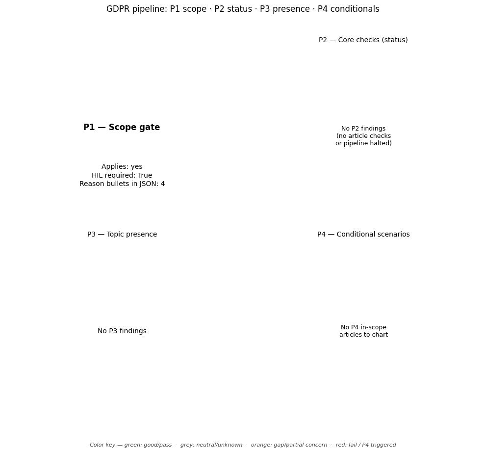

# GDPR Compliance Audit Report

**Target Document:** ../data/testing_files/md_files_pre_gdpr/test2_a1newspapers.md

## Distribution chart (P1–P4)
*(P1 = scope gate in JSON `scope`; P2–P4 = `findings` by `priority`.)*

## Scope assessment (P1)
Applies: **yes**

HIL required at scope: **True**

### Scope reasons
- The policy concerns the collection, protection, and use of personally identifiable information ('Personal Information') from users of a website and its services.
- While the text mentions exemptions for companies not owned or controlled and individuals not employed or managed, it does not explicitly claim any exemptions under GDPR Art. 2.
- The policy describes data processing activities that appear to fall under the material scope of GDPR Art. 2, which applies to the processing of personal data.
- The policy's territorial scope is not explicitly detailed, but the reference to a website suggests potential applicability if users are in the Union, as per GDPR Art. 3.

## Executive summary
**Overall compliance score (P2-only index):** 0% — _not based on article checks; workflow halted at scope / P1 gate before mapping and P2 scoring._

### Summary block (`summary` in JSON)
- **findings_total:** 0
- **hil_queue_total:** 1
- **overall_score_pct:** 0
- **p2_findings_total:** 0
- **p2_score:** 0.0
- **p3_findings_total:** 0
- **p4_articles_not_triggered:** 0
- **p4_triggered_total:** 0

### Counts used in the chart
- **P2:** total 0 — fail / partial / pass / other: 0 / 0 / 0 / 0
- **P3:** total 0 — topic present / absent / unknown: 0 / 0 / 0
- **P4:** triggered (summary) 0, triggered rows in `findings` 0, not triggered in scope 0
- **HIL queue items:** 1

## Findings breakdown (P2 / P3 / P4)

## Human-in-the-loop (HIL) review queue

**1. Gate handoff**
- Human intervention needed
- Reason: Scope gate flagged human escalation (hil_required)

