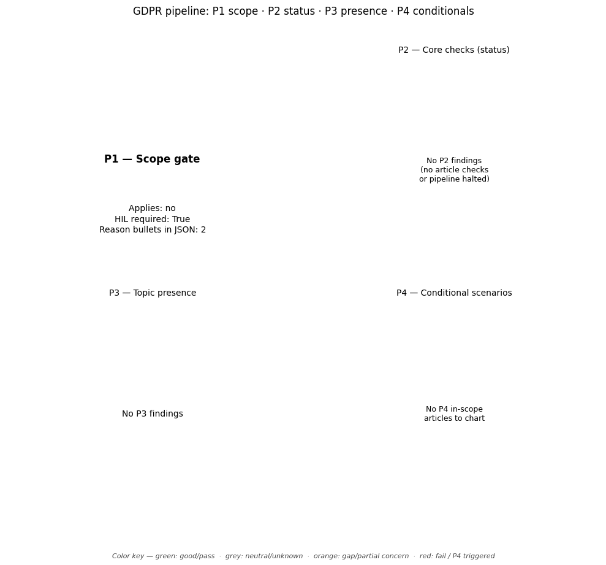

# GDPR Compliance Audit Report

**Target Document:** ../data/testing_files/md_files_pre_gdpr/test3_aap.md

## Distribution chart (P1–P4)
*(P1 = scope gate in JSON `scope`; P2–P4 = `findings` by `priority`.)*

## Scope assessment (P1)
Applies: **no**

HIL required at scope: **True**

### Scope reasons
- The policy text explicitly states it was archived in 2011 and extracted from a privacy policy predating GDPR.
- The policy states it does not apply to information collected through means other than the website, and does not provide sufficient detail on the processing of personal data to determine applicability under GDPR Art. 2.

## Executive summary
**Overall compliance score (P2-only index):** 0% — _not based on article checks; workflow halted at scope / P1 gate before mapping and P2 scoring._

### Summary block (`summary` in JSON)
- **findings_total:** 0
- **hil_queue_total:** 1
- **overall_score_pct:** 0
- **p2_findings_total:** 0
- **p2_score:** 0.0
- **p3_findings_total:** 0
- **p4_articles_not_triggered:** 0
- **p4_triggered_total:** 0

### Counts used in the chart
- **P2:** total 0 — fail / partial / pass / other: 0 / 0 / 0 / 0
- **P3:** total 0 — topic present / absent / unknown: 0 / 0 / 0
- **P4:** triggered (summary) 0, triggered rows in `findings` 0, not triggered in scope 0
- **HIL queue items:** 1

## Findings breakdown (P2 / P3 / P4)

## Human-in-the-loop (HIL) review queue

**1. Gate handoff**
- Human intervention needed
- Reason: GDPR scope not confirmed as in-scope (applies='no')

