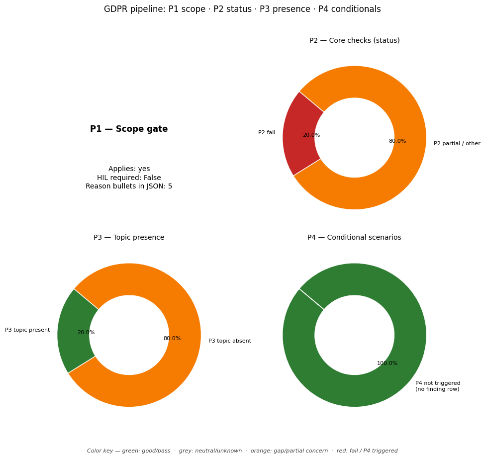

# GDPR Compliance Audit Report

**Target Document:** ../data/testing_files/md_files_post_gdpr/test3_slack.md

## Distribution chart (P1–P4)
*(P1 = scope gate in JSON `scope`; P2–P4 = `findings` by `priority`.)*

## Scope assessment (P1)
Applies: **yes**

HIL required at scope: **False**

### Scope reasons
- The company offers online workplace productivity tools and platforms, websites, and associated mobile and desktop applications, which likely involve the processing of personal data.
- The policy explicitly states it applies to Slack's services, websites, and other interactions, and the GDPR applies to the processing of personal data.
- The policy mentions 'customer service inquiries' and 'user conferences,' indicating potential processing of personal data in a business context.
- The policy mentions that a separate agreement governs the 'processing of any messages, files or other content submitted through Services accounts,' suggesting automated processing of data.
- Although the policy is linked to a German URL (en-de), the company targets users broadly, and the GDPR's territorial scope includes data subjects in the Union and activities of establishments in the Union.

## Executive summary
**Overall compliance score (P2-only index):** 40%

### Summary block (`summary` in JSON)
- **findings_total:** 40
- **hil_queue_total:** 15
- **overall_score_pct:** 40
- **p2_findings_total:** 25
- **p2_score:** 0.4
- **p3_findings_total:** 15
- **p4_articles_not_triggered:** 6
- **p4_triggered_total:** 0

### Counts used in the chart
- **P2:** total 25 — fail / partial / pass / other: 5 / 20 / 0 / 0
- **P3:** total 15 — topic present / absent / unknown: 3 / 12 / 0
- **P4:** triggered (summary) 0, triggered rows in `findings` 0, not triggered in scope 6
- **HIL queue items:** 15

## Findings breakdown (P2 / P3 / P4)

### Article 5: Principles relating to processing
- **Priority:** P2
- **Chapter:** Ch.2 – Principles
- **Risk level:** MEDIUM
- **Status:** PARTIAL

#### Identified gaps
* Lawfulness, fairness and transparency
* Data minimisation
* Accuracy
* Integrity and confidentiality

_Notes:_ The policy mentions purpose limitation and storage limitation to some extent, but does not explicitly address lawfulness, fairness, transparency, data minimisation, accuracy, or integrity and confidentiality. "Slack is a processor of Customer Data and Customer is the controller." This suggests a framework for lawfulness and fairness, but it is not explicitly stated in the policy text provided. Accuracy and integrity/confidentiality are not mentioned. Storage limitation is partially addressed by stating that data is retained for as long as necessary and in accordance with customer instructions, but specific limitations or retention periods are not detailed.

---

### Article 6: Lawfulness of processing
- **Priority:** P2
- **Chapter:** Ch.2 – Principles
- **Risk level:** MEDIUM
- **Status:** PARTIAL

#### Identified gaps
* No lawful basis stated for processing 'Other Information' for legitimate interests.

_Notes:_ The policy states that Slack uses 'Other Information' for its legitimate interests. However, it does not specify the nature of these legitimate interests, nor does it mention any balancing test conducted to ensure these interests are not overridden by the data subject's rights and freedoms, as required by Article 6(1)(f) of the GDPR. Therefore, the lawful basis is not sufficiently clear for this processing activity.

---

### Article 7: Conditions for consent
- **Priority:** P2
- **Chapter:** Ch.2 – Principles
- **Risk level:** HIGH
- **Status:** PARTIAL

#### Identified gaps
* The policy does not clearly state how consent is obtained for processing personal data, specifically regarding whether it is freely given, specific, informed, and unambiguous.
* The policy does not provide explicit details on the mechanism for withdrawing consent, nor does it confirm that withdrawal will be as easy as giving consent.
* There is no mention of whether consent is required for processing data that is not necessary for the performance of the contract (provision of the service).

_Notes:_ The provided policy excerpt does not contain explicit information regarding the conditions for obtaining consent as per GDPR Article 7. Specifically, it does not detail how consent is made freely given, specific, informed, and unambiguous. Furthermore, there is no mention of the process for withdrawing consent or ensuring it is as easy as giving it. The policy also lacks information on whether consent is conditional for processing data not necessary for the service's performance.

---

### Article 8: Child's consent
- **Priority:** P3
- **Chapter:** Ch.2 – Principles
- **Policy present:** True
- **Risk level:** NONE
- **Status:** N/A (P3/P4 OR UNSCORED)

---

### Article 9: Special category data
- **Priority:** P2
- **Chapter:** Ch.2 – Principles
- **Risk level:** HIGH
- **Status:** PARTIAL

#### Identified gaps
* Explicit consent or Art.9(2) derogation for sensitive data is not mentioned.

_Notes:_ The policy does not mention the handling of sensitive data categories as defined in GDPR Article 9. Therefore, it's unknown if explicit consent or any derogation under Article 9(2) is obtained or applied for processing such data.

---

### Article 10: Criminal convictions data
- **Priority:** P3
- **Chapter:** Ch.2 – Principles
- **Policy present:** False
- **Risk level:** NONE
- **Status:** N/A (P3/P4 OR UNSCORED)

---

### Article 11: Processing without identification
- **Priority:** P2
- **Chapter:** Ch.2 – Principles
- **Risk level:** LOW
- **Status:** PARTIAL

#### Identified gaps
* The policy does not explicitly state that Slack will not retain additional information solely for the purpose of identifying a data subject if identification is no longer required for the processing purposes.
* The policy does not provide information on how Slack would handle situations where it is unable to identify a data subject, or if data subjects would be informed in such cases.

_Notes:_ The policy mentions de-identification of information, which aligns with the principle of not maintaining identification if not required. However, it does not explicitly cover the specific requirements of Article 11(1) regarding not retaining additional information solely for identification, nor does it address the notification obligation in Article 11(2) if identification is not possible.

---

### Article 12: Transparency & modalities
- **Priority:** P2
- **Chapter:** Ch.3 – Rights of data subjects
- **Risk level:** MEDIUM
- **Status:** PARTIAL

#### Identified gaps
* The policy does not specify a one-month response commitment for data subject requests, nor does it mention the possibility of a two-month extension for complex requests.
* The policy does not explicitly state that information and communications regarding data subject rights will be provided free of charge, except in cases of unfounded or excessive requests.

_Notes:_ The policy mentions that Slack will respond within a reasonable timeframe, but does not explicitly state the one-month commitment or the conditions for extension as required by GDPR Article 12(3). It also does not explicitly mention that responses will be free of charge as per GDPR Article 12(5).

---

### Article 13: Info collected from data subject
- **Priority:** P2
- **Chapter:** Ch.3 – Rights of data subjects
- **Risk level:** MEDIUM
- **Status:** PARTIAL

#### Identified gaps
* The policy does not explicitly state the contact details of the data protection officer (DPO).
* The policy does not explicitly state the recipients or categories of recipients of the personal data.
* The policy does not explicitly state whether the provision of personal data is a statutory or contractual requirement, or a requirement necessary to enter into a contract, as well as whether the data subject is obliged to provide the personal data and of the possible consequences of failure to provide such data.
* The policy does not explicitly mention the existence of automated decision-making, including profiling, and meaningful information about the logic involved, as well as the significance and the envisaged consequences of such processing for the data subject.

_Notes:_ The policy mentions that Slack is a processor and the Customer is the controller, which implies the Customer should provide the full privacy notice. However, the policy itself is incomplete according to Article 13 of GDPR.

---

### Article 14: Info not obtained from data subject
- **Priority:** P2
- **Chapter:** Ch.3 – Rights of data subjects
- **Risk level:** HIGH
- **Status:** PARTIAL

#### Identified gaps
* The policy does not explicitly state the identity and contact details of the controller or their representative.
* The policy does not mention the contact details of the Data Protection Officer (DPO), if applicable.
* The policy does not specify the purposes of processing and the legal basis for processing for data not obtained directly from the data subject.
* The policy does not list the categories of personal data collected indirectly.
* The policy does not mention whether the controller intends to transfer personal data to a third country or international organization, nor does it reference safeguards for such transfers.
* The policy does not explicitly state the period for which indirectly obtained personal data will be stored, or the criteria used to determine this period.
* The policy does not specify the source of the personal data when it is not obtained from the data subject.
* The policy does not mention the existence of automated decision-making, including profiling, for indirectly obtained data.

_Notes:_ The policy does not sufficiently address the requirements of GDPR Article 14 for data not obtained from the data subject. Key information such as the identity and contact details of the controller, DPO contact details, purposes and legal basis for processing, data categories, storage periods, and origin of data is missing. While the policy mentions that Slack is a processor and the Customer is the controller for Customer Data, it does not provide the necessary Article 14 information from the perspective of the controller for data collected indirectly. The lack of information regarding the source of indirectly obtained data and the specific criteria for data retention for such data are significant gaps.

---

### Article 15: Right of access
- **Priority:** P2
- **Chapter:** Ch.3 – Rights of data subjects
- **Risk level:** CRITICAL
- **Status:** FAIL

#### Identified gaps
* The policy does not describe the process for submitting a Subject Access Request (SAR).
* The policy does not specify the timeline for responding to SARs.
* The policy does not outline the identity verification process for SARs.
* The policy does not detail what information will be provided to the data subject upon receipt of a SAR.

_Notes:_ The policy fails to address key aspects of the SAR process, including submission, response timelines, identity verification, and the information provided. This constitutes a critical risk as it does not comply with GDPR Article 15 requirements.

---

### Article 16: Right to rectification
- **Priority:** P2
- **Chapter:** Ch.3 – Rights of data subjects
- **Risk level:** MEDIUM
- **Status:** PARTIAL

#### Identified gaps
* The policy does not explicitly mention a right to rectification for data subjects or the timeframe for such rectification ('without undue delay'). It mentions contacting the Customer to request removal of Personal Data, but not rectification.
* The policy does not describe the process or timeframe for rectifying inaccurate personal data.

_Notes:_ The provided policy text does not contain information regarding the right to rectification or the timeframe ('without undue delay') for rectifying inaccurate personal data. It only mentions contacting the customer to request removal of personal data. Therefore, compliance cannot be fully verified.

---

### Article 17: Right to erasure
- **Priority:** P2
- **Chapter:** Ch.3 – Rights of data subjects
- **Risk level:** MEDIUM
- **Status:** PARTIAL

#### Identified gaps
* The policy does not describe the grounds for refusal of a deletion request.
* The policy does not explicitly mention exceptions to deletion or retention policies.

_Notes:_ The policy mentions that customers can request the removal of Personal Data under their control. However, it does not detail the process for handling such requests, the grounds for refusal, or any exceptions to the deletion/retention policy. This information is crucial for a complete Article 17 assessment.

---

### Article 18: Right to restriction
- **Priority:** P2
- **Chapter:** Ch.3 – Rights of data subjects
- **Risk level:** MEDIUM
- **Status:** PARTIAL

#### Identified gaps
* The policy does not explicitly describe the right to processing restriction, commonly known as a 'processing freeze' or 'data hold'.

_Notes:_ The policy mentions the right to restrict use of 'Other Information' under applicable law but does not explicitly detail the conditions or process for invoking a general restriction of processing for personal data as outlined in GDPR Article 18.

---

### Article 19: Notification on rectification/erasure
- **Priority:** P3
- **Chapter:** Ch.3 – Rights of data subjects
- **Policy present:** False
- **Risk level:** NONE
- **Status:** N/A (P3/P4 OR UNSCORED)

_Notes:_ The policy does not mention the obligation to notify recipients upon rectification or erasure of personal data, which is the core of Article 19.

---

### Article 20: Right to data portability
- **Priority:** P2
- **Chapter:** Ch.3 – Rights of data subjects
- **Risk level:** HIGH
- **Status:** FAIL

#### Identified gaps
* The policy does not explicitly mention that personal data can be received by the data subject in a structured, commonly used, and machine-readable format.
* The policy does not mention the right of the data subject to transmit their data to another controller without hindrance.
* The policy does not mention the right to have personal data transmitted directly from one controller to another, where technically feasible.

_Notes:_ The policy lacks specific details regarding the right to data portability as outlined in GDPR Article 20. There is no mention of providing data in a structured, commonly used, and machine-readable format, nor is there a clear statement about the right to transmit data to another controller or direct controller-to-controller transfers.

---

### Article 21: Right to object
- **Priority:** P2
- **Chapter:** Ch.3 – Rights of data subjects
- **Risk level:** MEDIUM
- **Status:** PARTIAL

#### Identified gaps
* The policy does not explicitly mention the right to object to direct marketing or profiling. It also does not specify how this right can be exercised, particularly through automated means.
* The policy does not state that the right to object will be brought to the data subject's attention clearly and separately from other information at the latest at the time of the first communication.

_Notes:_ The policy mentions the right to opt-out of 'sales' and the right to restrict use of 'Other Information', which are related but not explicitly the right to object to direct marketing or profiling as required by GDPR Article 21. The policy does not detail how individuals can exercise this right, nor does it confirm it will be presented clearly and separately at the point of first contact.

---

### Article 22: Automated decision-making
- **Priority:** P2
- **Chapter:** Ch.3 – Rights of data subjects
- **Risk level:** CRITICAL
- **Status:** PARTIAL

#### Identified gaps
* The policy does not mention the right not to be subject to automated decision-making.
* The policy does not mention any exceptions or conditions under which automated decision-making is permissible.
* The policy does not detail measures to safeguard rights and freedoms in cases of automated decision-making, such as the right to human intervention, to express a point of view, or to contest a decision.

_Notes:_ The provided policy text does not contain any information related to Article 22 of the GDPR, which covers automated decision-making, including profiling. There is no mention of the right not to be subject to such decisions, the conditions under which they are permissible, or the safeguards (like human intervention or the right to contest) that must be in place. Therefore, compliance with this article cannot be verified from the given text.

---

### Article 24: Responsibility of the controller
- **Priority:** P2
- **Chapter:** Ch.4 – Controller & processor
- **Risk level:** HIGH
- **Status:** FAIL

#### Identified gaps
* The policy does not contain specific information about the implementation of technical and organisational measures to ensure and demonstrate compliance with data protection regulations.

_Notes:_ The policy mentions that Slack is a processor of Customer Data and the Customer is the controller. It also states that Slack will use Other Information in furtherance of its legitimate interests and retain Other Information as long as necessary for described purposes, including demonstrating compliance with legal obligations. However, there is no explicit mention of the controller's responsibility to implement appropriate technical and organisational measures to ensure and demonstrate compliance with GDPR, as required by Article 24(1) and (2). There is also no mention of adherence to approved codes of conduct or certification mechanisms as an element to demonstrate compliance, as per Article 24(3).

---

### Article 25: Privacy by design and default
- **Priority:** P3
- **Chapter:** Ch.4 – Controller & processor
- **Policy present:** False
- **Risk level:** NONE
- **Status:** N/A (P3/P4 OR UNSCORED)

_Notes:_ The policy does not explicitly mention 'privacy by design' or 'privacy by default'. While it discusses data security, user controls, and how data is processed, it lacks specific language indicating a commitment to these principles as required by Article 25.

---

### Article 26: Joint controllers
- **Priority:** P3
- **Chapter:** Ch.4 – Controller & processor
- **Policy present:** False
- **Risk level:** NONE
- **Status:** N/A (P3/P4 OR UNSCORED)

_Notes:_ The policy does not mention joint controllership. It distinguishes between a "controller" (the Customer) and a "processor" (Slack) for Customer Data, and states Slack is the controller of Other Information. There is no indication of a joint controller arrangement.

---

### Article 27: Representatives (non-EU)
- **Priority:** P3
- **Chapter:** Ch.4 – Controller & processor
- **Policy present:** False
- **Risk level:** NONE
- **Status:** N/A (P3/P4 OR UNSCORED)

_Notes:_ The provided policy text does not contain information about appointing a representative for non-EU entities or the requirement for a written mandate, which are the core aspects of GDPR Article 27.

---

### Article 28: Processor / DPA
- **Priority:** P2
- **Chapter:** Ch.4 – Controller & processor
- **Risk level:** MEDIUM
- **Status:** PARTIAL

#### Identified gaps
* The policy does not explicitly mention a sub-processor list, although it states that the Customer Agreement governs these matters.
* There is no explicit mention of audit rights for the controller within the provided policy text.
* The policy does not explicitly detail the deletion or return obligation of personal data upon termination of services in the provided text, although it mentions deletion and/or de-identification.
* The policy does not explicitly state that the processor will only process data on documented instructions from the controller, other than stating 'Customer Data will be used by Slack in accordance with Customer’s instructions'.

_Notes:_ The policy confirms Slack acts as a processor and will use Customer Data according to Customer's instructions. However, specific clauses related to sub-processor lists, audit rights, explicit documented instructions for all processing, and detailed deletion/return obligations are not directly present in the provided text. These details are likely covered in the 'Customer Agreement,' but based solely on the provided policy text, the compliance is partial.

---

### Article 29: Processing under authority
- **Priority:** P2
- **Chapter:** Ch.4 – Controller & processor
- **Risk level:** HIGH
- **Status:** FAIL

#### Identified gaps
* The policy does not explicitly state that Slack, as a processor, will only process customer data under the explicit instructions of the customer (controller), unless required by law. While it mentions using data 'in accordance with Customer’s instructions', this does not fully capture the nuance of Article 29 which focuses on the authority under which the processor acts.

_Notes:_ The policy excerpt does not contain specific wording that directly addresses the GDPR Article 29 requirement that a processor and any person acting under their authority shall not process personal data except on instructions from the controller, unless required by Union or Member State law. It states 'Customer Data will be used by Slack in accordance with Customer’s instructions' and 'Slack will solely share and disclose Customer Data in accordance with a Customer’s instructions', but this does not explicitly cover the 'unless required to do so by Union or Member State law' aspect, nor does it detail the authority for persons acting under Slack's authority.

---

### Article 30: Records of processing (ROPA)
- **Priority:** P2
- **Chapter:** Ch.4 – Controller & processor
- **Risk level:** HIGH
- **Status:** FAIL

#### Identified gaps
* ROPA existence
* ROPA purposes coverage
* ROPA categories of data subjects coverage
* ROPA categories of personal data coverage
* ROPA recipients coverage
* ROPA retention periods coverage
* ROPA security measures coverage

_Notes:_ The provided policy text does not contain any information about the existence of a Record of Processing Activities (ROPA). Therefore, it is not possible to verify if it covers the required elements such as purposes, categories of data subjects and personal data, recipients, retention periods, and security measures.

---

### Article 32: Security of processing
- **Priority:** P3
- **Chapter:** Ch.4 – Controller & processor
- **Policy present:** True
- **Risk level:** NONE
- **Status:** N/A (P3/P4 OR UNSCORED)

---

### Article 33: Breach notification to SA
- **Priority:** P3
- **Chapter:** Ch.4 – Controller & processor
- **Policy present:** False
- **Risk level:** NONE
- **Status:** N/A (P3/P4 OR UNSCORED)

_Notes:_ The provided text focuses on general data protection, user rights, data sharing, and security measures. It does not contain specific information regarding breach notification procedures to a supervisory authority within a 72-hour timeframe, nor does it mention the contact details of a Data Protection Officer (DPO) in that context. Therefore, the policy does not materially address the topics covered by GDPR Article 33.

---

### Article 34: Breach communication to data subject
- **Priority:** P3
- **Chapter:** Ch.4 – Controller & processor
- **Policy present:** False
- **Risk level:** NONE
- **Status:** N/A (P3/P4 OR UNSCORED)

_Notes:_ The policy does not contain any information about breach communication procedures to data subjects, which is the core topic of GDPR Article 34. It focuses on data processing, sharing, security, and user rights, but not on the specific procedure for notifying individuals in case of a data breach.

---

### Article 35: DPIA
- **Priority:** P3
- **Chapter:** Ch.4 – Controller & processor
- **Policy present:** False
- **Risk level:** NONE
- **Status:** N/A (P3/P4 OR UNSCORED)

_Notes:_ The policy does not mention Data Protection Impact Assessments (DPIAs) or related concepts such as "risk assessment" in the context of data processing.

---

### Article 37: DPO designation
- **Priority:** P2
- **Chapter:** Ch.4 – Controller & processor
- **Risk level:** HIGH
- **Status:** PARTIAL

#### Identified gaps
* The policy does not mention whether Slack is a public authority or body.
* The policy does not state if Slack engages in the large-scale monitoring of data subjects.
* The policy does not confirm if Slack processes special categories of data or data relating to criminal convictions on a large scale.
* The policy does not provide contact details for a Data Protection Officer (DPO) or state how these details are published and communicated to supervisory authorities.

_Notes:_ The provided policy text does not contain information regarding the designation of a Data Protection Officer (DPO) by Slack. It is unclear whether Slack's core activities necessitate DPO appointment based on Article 37(1)(a), (b), or (c). Furthermore, there is no mention of DPO contact details being published as required by Article 37(7).

---

### Article 38: DPO position
- **Priority:** P3
- **Chapter:** Ch.4 – Controller & processor
- **Policy present:** False
- **Risk level:** NONE
- **Status:** N/A (P3/P4 OR UNSCORED)

_Notes:_ The provided text mentions "Data Protection Officer" but does not elaborate on the DPO's position, independence, or reporting lines, which are the core aspects of GDPR Article 38.

---

### Article 39: DPO tasks
- **Priority:** P2
- **Chapter:** Ch.4 – Controller & processor
- **Risk level:** MEDIUM
- **Status:** PARTIAL

#### Identified gaps
* DPO tasks related to advising and monitoring compliance, DPIA involvement, and cooperation with supervisory authorities are not explicitly detailed in the provided policy excerpt.

_Notes:_ The provided policy excerpt does not contain information regarding the specific tasks and responsibilities of a Data Protection Officer (DPO) as outlined in GDPR Article 39. Therefore, it is not possible to verify if the DPO mandate covers advising, monitoring compliance, DPIA involvement, or cooperation with supervisory authorities based solely on the given text.

---

### Article 40: Codes of conduct
- **Priority:** P3
- **Chapter:** Ch.4 – Controller & processor
- **Policy present:** False
- **Risk level:** NONE
- **Status:** N/A (P3/P4 OR UNSCORED)

_Notes:_ The policy does not mention codes of conduct or similar mechanisms for ensuring data protection compliance, which is the subject of GDPR Article 40.

---

### Article 42: Certification
- **Priority:** P3
- **Chapter:** Ch.4 – Controller & processor
- **Policy present:** False
- **Risk level:** NONE
- **Status:** N/A (P3/P4 OR UNSCORED)

_Notes:_ The policy mentions "security certifications" but does not provide details about specific certifications or how claims are verified, which is the core of Article 42.

---

### Article 44: General principle for transfers
- **Priority:** P2
- **Chapter:** Ch.5 – Transfers to third countries
- **Risk level:** MEDIUM
- **Status:** PARTIAL

#### Identified gaps
* The policy does not explicitly state that all international transfers of personal data comply with Chapter V mechanisms (Articles 44-50 of the GDPR).

_Notes:_ The policy does not contain specific information regarding compliance with Chapter V mechanisms for international data transfers. While it mentions compliance with 'applicable law' and legal obligations (c4), it does not detail how international transfers are governed or ensure the level of protection guaranteed by the GDPR is maintained for such transfers.

---

### Article 45: Adequacy decision transfers
- **Priority:** P2
- **Chapter:** Ch.5 – Transfers to third countries
- **Risk level:** MEDIUM
- **Status:** PARTIAL

#### Identified gaps
* The policy does not specify any third countries to which personal data may be transferred based on an adequacy decision.

_Notes:_ The policy does not contain any information regarding adequacy decisions for international data transfers, which is a requirement under GDPR Article 45. Therefore, it is not possible to verify compliance with this article based on the provided text.

---

### Article 46: Transfers with safeguards
- **Priority:** P3
- **Chapter:** Ch.5 – Transfers to third countries
- **Policy present:** True
- **Risk level:** NONE
- **Status:** N/A (P3/P4 OR UNSCORED)

_Notes:_ The policy explicitly mentions "Standard Contractual Clauses" and "European Union Model Clauses" as safeguards for international data transfers, directly addressing the core topic of GDPR Article 46. While it doesn't detail the execution status or recency of these contracts (which would require human review), the substantive mention of these safeguards is present.

---

### Article 47: Binding corporate rules
- **Priority:** P3
- **Chapter:** Ch.5 – Transfers to third countries
- **Policy present:** False
- **Risk level:** NONE
- **Status:** N/A (P3/P4 OR UNSCORED)

_Notes:_ The provided policy text does not contain any information related to "Binding Corporate Rules" (BCRs) or their approval by Data Protection Authorities (DPAs). Therefore, the policy does not address the topic of GDPR Article 47.

---

### Article 77: Right to lodge a complaint
- **Priority:** P2
- **Chapter:** Ch.8 – Remedies, liability & penalties
- **Risk level:** MEDIUM
- **Status:** PARTIAL

#### Identified gaps
* Policy does not explicitly state how to lodge a complaint with a supervisory authority, only mentions the right to do so.

_Notes:_ The policy acknowledges the right to lodge a complaint with a supervisory authority but does not provide details on how a data subject can exercise this right, such as providing contact information or a link to relevant supervisory authority websites. The policy only mentions contacting the Irish Data Protection Commissioner or the UK supervisory authority, the Information Commissioner's Office, but does not specify the process for lodging a complaint.

---

### Article 88: Employment context
- **Priority:** P2
- **Chapter:** Ch.9 – Specific processing situations
- **Risk level:** HIGH
- **Status:** PARTIAL

#### Identified gaps
* recruitment
* performance of the contract of employment
* management, planning and organisation of work
* equality and diversity in the workplace
* health and safety at work
* protection of employer's or customer's property
* exercise and enjoyment, on an individual or collective basis, of rights and benefits related to employment
* termination of the employment relationship
* suitable and specific measures to safeguard the data subject's human dignity
* suitable and specific measures to safeguard the data subject's legitimate interests
* suitable and specific measures to safeguard the data subject's fundamental rights
* transparency of processing
* transfer of personal data within a group of undertakings, or a group of enterprises engaged in a joint economic activity
* monitoring systems at the work place

_Notes:_ The provided policy excerpt does not contain specific details regarding the processing of employee personal data in the employment context, such as recruitment, contract performance, health and safety, or termination. While it mentions that the Customer (e.g., employer) controls its workspace and associated data, and determines its own policies for sharing and disclosure, it does not outline the specific measures Slack or the Customer must take to comply with Article 88's requirements for employee data protection.

---

## Human-in-the-loop (HIL) review queue

**1. Article 8: Child's consent**
- Type: p3_verify
- Notes: None

**2. Article 10: Criminal convictions data**
- Type: p3_verify
- Notes: None

**3. Article 19: Notification on rectification/erasure**
- Type: p3_verify
- Notes: The policy does not mention the obligation to notify recipients upon rectification or erasure of personal data, which is the core of Article 19.

**4. Article 25: Privacy by design and default**
- Type: p3_verify
- Notes: The policy does not explicitly mention 'privacy by design' or 'privacy by default'. While it discusses data security, user controls, and how data is processed, it lacks specific language indicating a commitment to these principles as required by Article 25.

**5. Article 26: Joint controllers**
- Type: p3_verify
- Notes: The policy does not mention joint controllership. It distinguishes between a "controller" (the Customer) and a "processor" (Slack) for Customer Data, and states Slack is the controller of Other Information. There is no indication of a joint controller arrangement.

**6. Article 27: Representatives (non-EU)**
- Type: p3_verify
- Notes: The provided policy text does not contain information about appointing a representative for non-EU entities or the requirement for a written mandate, which are the core aspects of GDPR Article 27.

**7. Article 32: Security of processing**
- Type: p3_verify
- Notes: None

**8. Article 33: Breach notification to SA**
- Type: p3_verify
- Notes: The provided text focuses on general data protection, user rights, data sharing, and security measures. It does not contain specific information regarding breach notification procedures to a supervisory authority within a 72-hour timeframe, nor does it mention the contact details of a Data Protection Officer (DPO) in that context. Therefore, the policy does not materially address the topics covered by GDPR Article 33.

**9. Article 34: Breach communication to data subject**
- Type: p3_verify
- Notes: The policy does not contain any information about breach communication procedures to data subjects, which is the core topic of GDPR Article 34. It focuses on data processing, sharing, security, and user rights, but not on the specific procedure for notifying individuals in case of a data breach.

**10. Article 35: DPIA**
- Type: p3_verify
- Notes: The policy does not mention Data Protection Impact Assessments (DPIAs) or related concepts such as "risk assessment" in the context of data processing.

**11. Article 38: DPO position**
- Type: p3_verify
- Notes: The provided text mentions "Data Protection Officer" but does not elaborate on the DPO's position, independence, or reporting lines, which are the core aspects of GDPR Article 38.

**12. Article 40: Codes of conduct**
- Type: p3_verify
- Notes: The policy does not mention codes of conduct or similar mechanisms for ensuring data protection compliance, which is the subject of GDPR Article 40.

**13. Article 42: Certification**
- Type: p3_verify
- Notes: The policy mentions "security certifications" but does not provide details about specific certifications or how claims are verified, which is the core of Article 42.

**14. Article 46: Transfers with safeguards**
- Type: p3_verify
- Notes: The policy explicitly mentions "Standard Contractual Clauses" and "European Union Model Clauses" as safeguards for international data transfers, directly addressing the core topic of GDPR Article 46. While it doesn't detail the execution status or recency of these contracts (which would require human review), the substantive mention of these safeguards is present.

**15. Article 47: Binding corporate rules**
- Type: p3_verify
- Notes: The provided policy text does not contain any information related to "Binding Corporate Rules" (BCRs) or their approval by Data Protection Authorities (DPAs). Therefore, the policy does not address the topic of GDPR Article 47.

