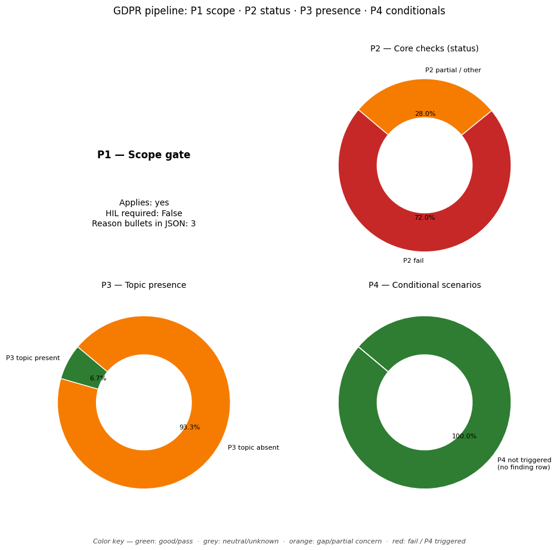

# GDPR Compliance Audit Report

**Target Document:** ../data/testing_files/md_files_pre_gdpr/test4_a4add.md

## Distribution chart (P1–P4)
*(P1 = scope gate in JSON `scope`; P2–P4 = `findings` by `priority`.)*

## Scope assessment (P1)
Applies: **yes**

HIL required at scope: **False**

### Scope reasons
- The policy describes the collection and use of personal information (IP addresses, browser type, etc.) which constitutes processing of personal data.
- The company, www.a4add.com, appears to be established or targets users in the Union by having a website accessible in the Union and collecting data typically associated with website visitors.
- The material scope states the Regulation applies to automated processing of personal data, which log files and website analytics typically involve.

## Executive summary
**Overall compliance score (P2-only index):** 14%

### Summary block (`summary` in JSON)
- **findings_total:** 40
- **hil_queue_total:** 15
- **overall_score_pct:** 14
- **p2_findings_total:** 25
- **p2_score:** 0.14
- **p3_findings_total:** 15
- **p4_articles_not_triggered:** 6
- **p4_triggered_total:** 0

### Counts used in the chart
- **P2:** total 25 — fail / partial / pass / other: 18 / 7 / 0 / 0
- **P3:** total 15 — topic present / absent / unknown: 1 / 14 / 0
- **P4:** triggered (summary) 0, triggered rows in `findings` 0, not triggered in scope 6
- **HIL queue items:** 15

## Findings breakdown (P2 / P3 / P4)

### Article 5: Principles relating to processing
- **Priority:** P2
- **Chapter:** Ch.2 – Principles
- **Risk level:** MEDIUM
- **Status:** PARTIAL

#### Identified gaps
* Lawfulness, fairness, and transparency
* Purpose limitation
* Data minimisation
* Accuracy
* Storage limitation
* Accountability

_Notes:_ The policy mentions the collection of log files, cookies, and user preferences for analytics and personalization. It also states that IP addresses are not linked to personally identifiable information. However, it does not explicitly address lawfulness, fairness, transparency, purpose limitation, data minimisation, accuracy, storage limitation, or accountability in detail. The policy is also a pre-GDPR document and its applicability to current GDPR standards is unclear. There is no mention of how long data is stored or how it is secured.

---

### Article 6: Lawfulness of processing
- **Priority:** P2
- **Chapter:** Ch.2 – Principles
- **Risk level:** CRITICAL
- **Status:** FAIL

#### Identified gaps
* Lawful basis for processing is not stated for any processing activity.

_Notes:_ The policy does not state a lawful basis for any processing activity, which is a critical gap according to GDPR Article 6.

---

### Article 7: Conditions for consent
- **Priority:** P2
- **Chapter:** Ch.2 – Principles
- **Risk level:** HIGH
- **Status:** FAIL

#### Identified gaps
* Consent is not specific, informed, or unambiguous.
* There is no clear mechanism for withdrawing consent.
* It is not demonstrated that consent is freely given, as it is conditional on using the website.
* The policy does not clearly distinguish consent from other terms and conditions.

_Notes:_ The policy states 'By using our website, you hereby consent to our privacy policy and agree to its terms.' This implies consent is a condition of using the service, which may not be freely given. Additionally, the consent is broad and does not specify what data processing it applies to, nor does it mention how to withdraw consent. This meets the definition of 'broad consent' which is not valid under GDPR. Consent needs to be specific, informed, unambiguous, and freely given. Withdrawal of consent must be as easy as giving it.

---

### Article 8: Child's consent
- **Priority:** P3
- **Chapter:** Ch.2 – Principles
- **Policy present:** True
- **Risk level:** NONE
- **Status:** N/A (P3/P4 OR UNSCORED)

_Notes:_ The policy addresses the collection of information from children under 13 and outlines a procedure for parents to contact the site if they believe their child's information has been collected. This aligns with Article 8's focus on the conditions under which a child's consent is valid in relation to information society services.

---

### Article 9: Special category data
- **Priority:** P2
- **Chapter:** Ch.2 – Principles
- **Risk level:** HIGH
- **Status:** PARTIAL

#### Identified gaps
* No explicit consent or Article 9(2) derogation is stated for the processing of special category data, if any is collected.

_Notes:_ The policy does not mention the collection or processing of special category data (health, racial, religious, etc.). Therefore, it is not possible to verify if explicit consent or an Article 9(2) derogation is in place for such data. The guidance requires verification of explicit consent or a derogation if sensitive data keywords are found. As no such keywords are present, the check is partial.

---

### Article 10: Criminal convictions data
- **Priority:** P3
- **Chapter:** Ch.2 – Principles
- **Policy present:** False
- **Risk level:** NONE
- **Status:** N/A (P3/P4 OR UNSCORED)

---

### Article 11: Processing without identification
- **Priority:** P2
- **Chapter:** Ch.2 – Principles
- **Risk level:** MEDIUM
- **Status:** PARTIAL

#### Identified gaps
* The policy does not clearly state whether data is processed without identification, nor does it detail any measures taken if it is.
* There is no information on how the company handles situations where data subjects cannot be identified, or how it informs them if identification is not possible.
* The policy does not mention any specific procedures for exercising data subject rights (Articles 15-20) when identification is not possible.

_Notes:_ The policy mentions that IP addresses are not linked to personally identifiable information. However, it does not elaborate on how the company processes data without identification, nor does it provide information regarding the notification of data subjects when identification is not possible or the application of Articles 15-20 in such scenarios. This is insufficient to fully assess compliance with Article 11.

---

### Article 12: Transparency & modalities
- **Priority:** P2
- **Chapter:** Ch.3 – Rights of data subjects
- **Risk level:** CRITICAL
- **Status:** FAIL

#### Identified gaps
* The policy does not specify a response time commitment for data subject requests.
* The policy does not explicitly state that information will be provided in a concise, transparent, intelligible, and easily accessible form using clear and plain language.
* The policy does not mention providing information by electronic means or other appropriate methods.
* The policy does not state that information will be provided free of charge.

_Notes:_ The policy is outdated and does not address GDPR requirements for transparency and modalities of communication regarding data subject rights. Specifically, it lacks information on response times, clarity of information, methods of communication (including electronic means), and the free of charge principle for providing information.

---

### Article 13: Info collected from data subject
- **Priority:** P2
- **Chapter:** Ch.3 – Rights of data subjects
- **Risk level:** CRITICAL
- **Status:** FAIL

#### Identified gaps
* Controller identity and contact details
* Data Protection Officer contact details
* Purposes of the processing and legal basis
* Legitimate interests pursued
* Recipients or categories of recipients
* Transfer of personal data to third countries
* Retention period for personal data
* Data subject rights (access, rectification, erasure, restriction, objection, data portability)
* Right to withdraw consent
* Right to lodge a complaint with a supervisory authority
* Statutory or contractual requirement for data provision
* Automated decision-making and profiling

_Notes:_ The policy is from 2016 and does not contain any information required by Article 13 of the GDPR. It is missing all required elements, including controller identity, DPO contact, legal basis, retention period, recipients, and data subject rights.

---

### Article 14: Info not obtained from data subject
- **Priority:** P2
- **Chapter:** Ch.3 – Rights of data subjects
- **Risk level:** CRITICAL
- **Status:** FAIL

#### Identified gaps
* controller identity and contact details
* controller's representative identity and contact details
* data protection officer contact details
* purposes of the processing and legal basis
* categories of personal data
* recipients or categories of recipients
* data transfer to third countries or international organisations
* storage period or criteria for determining it
* legitimate interests pursued
* data subject rights (access, rectification, erasure, restriction, objection, portability)
* right to withdraw consent
* right to lodge a complaint with a supervisory authority
* source of personal data
* existence of automated decision-making, including profiling

_Notes:_ The provided policy is for a website from 2016 and does not contain information required by Article 14 of GDPR. The policy does not mention how data is obtained from third parties or any of the required information regarding the controller, purposes, legal basis, data categories, recipients, data transfers, storage periods, legitimate interests, data subject rights, source of data, or automated decision-making.

---

### Article 15: Right of access
- **Priority:** P2
- **Chapter:** Ch.3 – Rights of data subjects
- **Risk level:** HIGH
- **Status:** FAIL

#### Identified gaps
* The policy does not describe the process for data subjects to submit a Subject Access Request (SAR).
* The policy does not specify a timeline for responding to SARs.
* The policy does not mention any procedures for verifying the identity of the data subject making a SAR.
* The policy does not detail what information will be provided to the data subject in response to a SAR, nor does it cover the right to a copy of personal data.

_Notes:_ The policy is outdated (2016) and does not contain information related to the Subject Access Request (SAR) process as required by GDPR Article 15. Specifically, it lacks details on how to submit a request, the response timeline, identity verification, and the scope of information provided.

---

### Article 16: Right to rectification
- **Priority:** P2
- **Chapter:** Ch.3 – Rights of data subjects
- **Risk level:** HIGH
- **Status:** PARTIAL

#### Identified gaps
* The policy does not describe the 'right to rectification' as outlined in Article 16 of the GDPR. Specifically, it does not mention the right to obtain the rectification of inaccurate personal data or the completion of incomplete personal data, including by means of providing a supplementary statement. The policy also fails to state that such rectification should occur 'without undue delay'.

_Notes:_ The company policy does not address the right to rectification or the obligation to rectify personal data without undue delay. This is a significant gap concerning GDPR Article 16.

---

### Article 17: Right to erasure
- **Priority:** P2
- **Chapter:** Ch.3 – Rights of data subjects
- **Risk level:** HIGH
- **Status:** FAIL

#### Identified gaps
* The policy does not describe the process for data deletion requests.
* The policy does not mention any grounds for refusal of deletion requests.
* The policy does not detail any exceptions to deletion, such as retention requirements.

_Notes:_ The provided policy text does not contain any information regarding the right to erasure or the process for handling deletion requests. It is a pre-GDPR policy focused on general data collection and usage.

---

### Article 18: Right to restriction
- **Priority:** P2
- **Chapter:** Ch.3 – Rights of data subjects
- **Risk level:** HIGH
- **Status:** FAIL

#### Identified gaps
* Right to restriction of processing is not described.

_Notes:_ The provided policy text does not contain any information regarding the right to restriction of processing, which is a core right under GDPR Article 18. This includes not describing conditions under which processing can be restricted (e.g., accuracy of data, unlawful processing, controller no longer needing data, objection to processing pending verification), nor the implications of such a restriction (e.g., data can only be stored, or processed with consent, for legal claims, or for public interest).

---

### Article 19: Notification on rectification/erasure
- **Priority:** P3
- **Chapter:** Ch.3 – Rights of data subjects
- **Policy present:** False
- **Risk level:** NONE
- **Status:** N/A (P3/P4 OR UNSCORED)

_Notes:_ The policy does not mention downstream notification to recipients in case of rectification or erasure of personal data. The provided text focuses on data collection, cookies, third-party advertisers, and children's information, but lacks any information regarding the notification obligations stipulated in Article 19 of GDPR.

---

### Article 20: Right to data portability
- **Priority:** P2
- **Chapter:** Ch.3 – Rights of data subjects
- **Risk level:** HIGH
- **Status:** FAIL

#### Identified gaps
* The policy does not mention that data subjects have the right to receive their personal data in a structured, commonly used, and machine-readable format.
* The policy does not mention that data subjects have the right to transmit their personal data to another controller.
* The policy does not mention that data subjects have the right to have personal data transmitted directly from one controller to another, where technically feasible.

_Notes:_ The policy is from 2016 and does not reflect GDPR requirements for data portability.

---

### Article 21: Right to object
- **Priority:** P2
- **Chapter:** Ch.3 – Rights of data subjects
- **Risk level:** HIGH
- **Status:** FAIL

#### Identified gaps
* The company policy does not explicitly state how a user can object to direct marketing or profiling.
* The company policy does not mention the right to object to processing of personal data on grounds relating to a particular situation.
* The company policy does not mention that the right to object must be brought to the attention of the data subject explicitly and clearly.
* The company policy does not mention that the right to object can be exercised by automated means using technical specifications.

_Notes:_ The policy does not contain sufficient information to determine compliance with Article 21. Specifically, it lacks explicit provisions for users to object to direct marketing and profiling, nor does it detail how such objections are handled. The policy also fails to mention the requirement to inform users about their right to object at the time of first communication and the possibility of using automated means to exercise this right.

---

### Article 22: Automated decision-making
- **Priority:** P2
- **Chapter:** Ch.3 – Rights of data subjects
- **Risk level:** CRITICAL
- **Status:** FAIL

#### Identified gaps
* Disclosure of automated decision-making processes
* Right to human intervention
* Right to contest automated decisions
* Safeguards for automated decisions based on contract or consent

_Notes:_ The policy does not contain any information regarding automated decision-making, including profiling, nor does it mention any rights related to such processes, such as human intervention or the right to contest decisions. Therefore, compliance with GDPR Article 22 cannot be verified.

---

### Article 24: Responsibility of the controller
- **Priority:** P2
- **Chapter:** Ch.4 – Controller & processor
- **Risk level:** CRITICAL
- **Status:** FAIL

#### Identified gaps
* Accountability policy
* Data governance documentation
* Demonstrate-compliance language

_Notes:_ The policy provided does not contain any information about the controller's responsibility to implement appropriate technical and organisational measures to ensure and demonstrate compliance with data protection regulations, nor does it mention the review and updating of such measures. There is no evidence of accountability policies, data governance documentation, or demonstrate-compliance language.

---

### Article 25: Privacy by design and default
- **Priority:** P3
- **Chapter:** Ch.4 – Controller & processor
- **Policy present:** False
- **Risk level:** NONE
- **Status:** N/A (P3/P4 OR UNSCORED)

_Notes:_ The policy does not contain any mention of 'privacy by design' or 'privacy by default'. It also does not discuss the technical configurations or settings that would align with these principles.

---

### Article 26: Joint controllers
- **Priority:** P3
- **Chapter:** Ch.4 – Controller & processor
- **Policy present:** False
- **Risk level:** NONE
- **Status:** N/A (P3/P4 OR UNSCORED)

_Notes:_ The provided text does not contain any information about joint controllership. It discusses standard privacy policy elements like log files, cookies, third-party advertising, and children's information, but Article 26 (Joint Controllers) is not addressed.

---

### Article 27: Representatives (non-EU)
- **Priority:** P3
- **Chapter:** Ch.4 – Controller & processor
- **Policy present:** False
- **Risk level:** NONE
- **Status:** N/A (P3/P4 OR UNSCORED)

_Notes:_ The policy excerpt is from before GDPR and does not contain information about the appointment of a representative for non-EU entities.

---

### Article 28: Processor / DPA
- **Priority:** P2
- **Chapter:** Ch.4 – Controller & processor
- **Risk level:** CRITICAL
- **Status:** PARTIAL

#### Identified gaps
* The policy does not specify if a sub-processor list is maintained or if the controller has the right to object to new sub-processors.
* The policy does not detail audit rights for the controller to verify processor compliance.
* There is no mention of the processor's obligation to delete or return personal data and copies after service provision.
* The policy does not explicitly state that the processor acts only on the controller's documented instructions.

_Notes:_ The provided policy text is a pre-GDPR privacy policy from 2016 and does not contain any clauses related to Data Processing Agreements (DPAs) or Article 28 of the GDPR. Therefore, it's impossible to verify the presence of required DPA clauses such as sub-processor lists, audit rights, data deletion/return obligations, or adherence to documented instructions. The policy focuses on cookies, log files, and children's information, which are not directly relevant to Article 28 requirements.

---

### Article 29: Processing under authority
- **Priority:** P2
- **Chapter:** Ch.4 – Controller & processor
- **Risk level:** CRITICAL
- **Status:** FAIL

#### Identified gaps
* Processing under the authority of the controller or processor.
* Any person acting under the authority of the controller or processor, who has access to personal data, shall not process those data except on instructions from the controller, unless required to do so by Union or Member State law.

_Notes:_ The policy does not contain any information about the controller or processor providing instructions for processing personal data. There is no mention of a Data Processing Agreement (DPA) or any documented instructions for individuals processing data under the authority of the controller or processor. The provided text is a privacy policy from 2016 and does not cover the requirements of GDPR Article 29.

---

### Article 30: Records of processing (ROPA)
- **Priority:** P2
- **Chapter:** Ch.4 – Controller & processor
- **Risk level:** HIGH
- **Status:** FAIL

#### Identified gaps
* Purpose of processing
* Categories of data subjects
* Categories of personal data
* Categories of recipients
* Transfers to third countries
* Time limits for erasure
* Security measures

_Notes:_ The policy is outdated (pre-GDPR) and does not contain the required elements for a Record of Processing Activities (ROPA) under Article 30. It mentions collecting log files and cookies but lacks details on purposes, categories of data subjects and data, recipients, retention periods, or security measures. It is unclear if the company is an SME (fewer than 250 employees) and if the processing is occasional, which would determine if Article 30(5) exemption applies. Given the lack of information, a high risk is assigned.

---

### Article 32: Security of processing
- **Priority:** P3
- **Chapter:** Ch.4 – Controller & processor
- **Policy present:** False
- **Risk level:** NONE
- **Status:** N/A (P3/P4 OR UNSCORED)

_Notes:_ The policy excerpt does not contain information about encryption, access controls, incident response, or testing, which are key elements of GDPR Article 32.

---

### Article 33: Breach notification to SA
- **Priority:** P3
- **Chapter:** Ch.4 – Controller & processor
- **Policy present:** False
- **Risk level:** NONE
- **Status:** N/A (P3/P4 OR UNSCORED)

_Notes:_ The provided policy text is from before GDPR and does not contain information relevant to Article 33, such as breach notification procedures or timelines.

---

### Article 34: Breach communication to data subject
- **Priority:** P3
- **Chapter:** Ch.4 – Controller & processor
- **Policy present:** False
- **Risk level:** NONE
- **Status:** N/A (P3/P4 OR UNSCORED)

_Notes:_ The policy excerpt provided does not contain any information related to GDPR Article 34, which concerns breach communication to data subjects. The text focuses on general privacy policy information, log files, cookies, and children's information, pre-dating the GDPR.

---

### Article 35: DPIA
- **Priority:** P3
- **Chapter:** Ch.4 – Controller & processor
- **Policy present:** False
- **Risk level:** NONE
- **Status:** N/A (P3/P4 OR UNSCORED)

_Notes:_ The policy excerpt is from before GDPR and does not mention DPIA or any equivalent process for assessing data protection risks.

---

### Article 37: DPO designation
- **Priority:** P2
- **Chapter:** Ch.4 – Controller & processor
- **Risk level:** CRITICAL
- **Status:** FAIL

#### Identified gaps
* The company policy does not state whether the core activities of the controller or processor involve regular and systematic monitoring of data subjects on a large scale, or large-scale processing of special categories of data or data relating to criminal convictions and offences. Therefore, it is not possible to determine if a DPO is required under Article 37(1)(b) or (c).
* The company policy does not specify if the controller or processor is a public authority or body, which would mandate DPO designation under Article 37(1)(a).
* The company policy does not contain any information regarding the publication of contact details for a Data Protection Officer (DPO), as required by Article 37(7).

_Notes:_ The provided company policy text is outdated (pre-GDPR) and does not contain any information relevant to the current GDPR requirements for DPO designation. It is therefore impossible to assess compliance with Article 37 of the GDPR based on the provided policy. Key information regarding the nature and scale of processing, and whether the entity is a public authority, is missing. Furthermore, there is no mention of publishing DPO contact details.

---

### Article 38: DPO position
- **Priority:** P3
- **Chapter:** Ch.4 – Controller & processor
- **Policy present:** False
- **Risk level:** NONE
- **Status:** N/A (P3/P4 OR UNSCORED)

_Notes:_ The provided policy text does not contain any information related to the Data Protection Officer (DPO) position or their independence, which is the subject of Article 38 of the GDPR.

---

### Article 39: DPO tasks
- **Priority:** P2
- **Chapter:** Ch.4 – Controller & processor
- **Risk level:** HIGH
- **Status:** FAIL

#### Identified gaps
* DPO mandate covers advising the controller/processor and employees on data protection obligations.
* DPO mandate covers monitoring compliance with data protection regulations and internal policies.
* DPO mandate covers providing advice on data protection impact assessments and monitoring their performance.
* DPO mandate covers cooperating with the supervisory authority.
* DPO mandate covers acting as the contact point for the supervisory authority on processing issues.

_Notes:_ The provided policy document does not contain any information regarding the tasks or mandate of a Data Protection Officer (DPO). Therefore, it is not possible to verify if the DPO's responsibilities align with Article 39 of the GDPR, which includes advising on data protection, monitoring compliance, involvement in DPIAs, and cooperating with supervisory authorities.

---

### Article 40: Codes of conduct
- **Priority:** P3
- **Chapter:** Ch.4 – Controller & processor
- **Policy present:** False
- **Risk level:** NONE
- **Status:** N/A (P3/P4 OR UNSCORED)

_Notes:_ The provided policy text is a pre-GDPR privacy policy from 2016. It does not contain any mention of codes of conduct, adherence claims, or regulatory approval processes related to such codes, which are the core topics of GDPR Article 40.

---

### Article 42: Certification
- **Priority:** P3
- **Chapter:** Ch.4 – Controller & processor
- **Policy present:** False
- **Risk level:** NONE
- **Status:** N/A (P3/P4 OR UNSCORED)

_Notes:_ The provided policy excerpts do not contain any information related to certification claims, verification of certificates, or any other aspect of GDPR Article 42.

---

### Article 44: General principle for transfers
- **Priority:** P2
- **Chapter:** Ch.5 – Transfers to third countries
- **Risk level:** HIGH
- **Status:** PARTIAL

#### Identified gaps
* The policy does not specify any mechanisms for international data transfers.
* There is no information on compliance with Chapter 5 of the GDPR regarding international data transfers.

_Notes:_ The policy document provided is from before GDPR came into effect (2016). It does not contain any information regarding international data transfers or compliance with Chapter 5 of the GDPR, as required by Article 44. Therefore, it is not possible to assess compliance based on the provided text.

---

### Article 45: Adequacy decision transfers
- **Priority:** P2
- **Chapter:** Ch.5 – Transfers to third countries
- **Risk level:** HIGH
- **Status:** PARTIAL

#### Identified gaps
* The policy does not mention adequacy decisions for international data transfers, nor does it specify any countries or territories that are considered to have an adequate level of protection under Article 45 of the GDPR. Therefore, it is not possible to verify compliance with this article.

_Notes:_ The provided policy text is from before the GDPR came into effect and focuses on general privacy practices like cookies and log files. It does not contain any information related to international data transfers or adequacy decisions as required by Article 45 of the GDPR. Therefore, compliance with Article 45 cannot be determined.

---

### Article 46: Transfers with safeguards
- **Priority:** P3
- **Chapter:** Ch.5 – Transfers to third countries
- **Policy present:** False
- **Risk level:** NONE
- **Status:** N/A (P3/P4 OR UNSCORED)

_Notes:_ The provided text is a privacy policy from 2016 and predates GDPR. It does not mention GDPR, SCCs, BCRs, or any mechanisms for international data transfers with safeguards.

---

### Article 47: Binding corporate rules
- **Priority:** P3
- **Chapter:** Ch.5 – Transfers to third countries
- **Policy present:** False
- **Risk level:** NONE
- **Status:** N/A (P3/P4 OR UNSCORED)

_Notes:_ The policy does not mention or address Binding Corporate Rules (BCRs) or Data Protection Authority (DPA) approval, which are the core elements of this article and the agent action. The provided text focuses on general privacy practices like log files, cookies, and children's information, none of which relate to BCRs.

---

### Article 77: Right to lodge a complaint
- **Priority:** P2
- **Chapter:** Ch.8 – Remedies, liability & penalties
- **Risk level:** HIGH
- **Status:** FAIL

#### Identified gaps
* The policy does not inform data subjects of their right to lodge a complaint with a supervisory authority.
* The policy does not inform data subjects how to lodge a complaint with a supervisory authority.

_Notes:_ The policy does not mention the right to lodge a complaint with a supervisory authority or how to do so.

---

### Article 88: Employment context
- **Priority:** P2
- **Chapter:** Ch.9 – Specific processing situations
- **Risk level:** HIGH
- **Status:** FAIL

#### Identified gaps
* The policy does not cover recruitment.
* The policy does not cover the performance of the contract of employment.
* The policy does not cover management, planning and organisation of work.
* The policy does not cover equality and diversity in the workplace.
* The policy does not cover health and safety at work.
* The policy does not cover the protection of employer's or customer's property.
* The policy does not cover the exercise and enjoyment of rights and benefits related to employment.
* The policy does not cover the termination of the employment relationship.
* The policy does not mention specific measures to safeguard employees' human dignity, legitimate interests, and fundamental rights in the employment context.
* The policy does not mention transparency of processing for employees.
* The policy does not mention transfer of personal data within a group of undertakings or a group of enterprises engaged in a joint economic activity concerning employees.
* The policy does not mention monitoring systems at the workplace for employees.

_Notes:_ The provided policy text does not contain any information relevant to Article 88 of the GDPR, which deals with the processing of personal data in the employment context. Therefore, it is not possible to assess compliance with recruitment, performance of contract, management, health and safety, property protection, or termination procedures. Specific measures for safeguarding employee rights, transparency, data transfers within corporate groups, and workplace monitoring are also not addressed. As a result, the compliance status is 'fail' with a 'high' risk.

---

## Human-in-the-loop (HIL) review queue

**1. Article 8: Child's consent**
- Type: p3_verify
- Notes: The policy addresses the collection of information from children under 13 and outlines a procedure for parents to contact the site if they believe their child's information has been collected. This aligns with Article 8's focus on the conditions under which a child's consent is valid in relation to information society services.

**2. Article 10: Criminal convictions data**
- Type: p3_verify
- Notes: None

**3. Article 19: Notification on rectification/erasure**
- Type: p3_verify
- Notes: The policy does not mention downstream notification to recipients in case of rectification or erasure of personal data. The provided text focuses on data collection, cookies, third-party advertisers, and children's information, but lacks any information regarding the notification obligations stipulated in Article 19 of GDPR.

**4. Article 25: Privacy by design and default**
- Type: p3_verify
- Notes: The policy does not contain any mention of 'privacy by design' or 'privacy by default'. It also does not discuss the technical configurations or settings that would align with these principles.

**5. Article 26: Joint controllers**
- Type: p3_verify
- Notes: The provided text does not contain any information about joint controllership. It discusses standard privacy policy elements like log files, cookies, third-party advertising, and children's information, but Article 26 (Joint Controllers) is not addressed.

**6. Article 27: Representatives (non-EU)**
- Type: p3_verify
- Notes: The policy excerpt is from before GDPR and does not contain information about the appointment of a representative for non-EU entities.

**7. Article 32: Security of processing**
- Type: p3_verify
- Notes: The policy excerpt does not contain information about encryption, access controls, incident response, or testing, which are key elements of GDPR Article 32.

**8. Article 33: Breach notification to SA**
- Type: p3_verify
- Notes: The provided policy text is from before GDPR and does not contain information relevant to Article 33, such as breach notification procedures or timelines.

**9. Article 34: Breach communication to data subject**
- Type: p3_verify
- Notes: The policy excerpt provided does not contain any information related to GDPR Article 34, which concerns breach communication to data subjects. The text focuses on general privacy policy information, log files, cookies, and children's information, pre-dating the GDPR.

**10. Article 35: DPIA**
- Type: p3_verify
- Notes: The policy excerpt is from before GDPR and does not mention DPIA or any equivalent process for assessing data protection risks.

**11. Article 38: DPO position**
- Type: p3_verify
- Notes: The provided policy text does not contain any information related to the Data Protection Officer (DPO) position or their independence, which is the subject of Article 38 of the GDPR.

**12. Article 40: Codes of conduct**
- Type: p3_verify
- Notes: The provided policy text is a pre-GDPR privacy policy from 2016. It does not contain any mention of codes of conduct, adherence claims, or regulatory approval processes related to such codes, which are the core topics of GDPR Article 40.

**13. Article 42: Certification**
- Type: p3_verify
- Notes: The provided policy excerpts do not contain any information related to certification claims, verification of certificates, or any other aspect of GDPR Article 42.

**14. Article 46: Transfers with safeguards**
- Type: p3_verify
- Notes: The provided text is a privacy policy from 2016 and predates GDPR. It does not mention GDPR, SCCs, BCRs, or any mechanisms for international data transfers with safeguards.

**15. Article 47: Binding corporate rules**
- Type: p3_verify
- Notes: The policy does not mention or address Binding Corporate Rules (BCRs) or Data Protection Authority (DPA) approval, which are the core elements of this article and the agent action. The provided text focuses on general privacy practices like log files, cookies, and children's information, none of which relate to BCRs.

