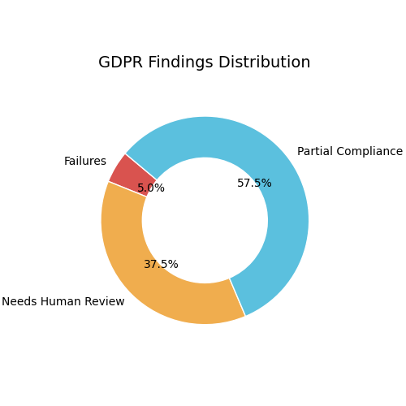

# GDPR Compliance Audit Report

**Target Document:** ../data/testing_files/md_files_post_gdpr/test4_zoho.md

## Distribution Chart
*(The visual findings distribution has been generated and saved)*

## Scope Assessment
Applies: **Yes**

### Scope Reasons:
- The policy describes collection of personal data (name, contact number, email address, company name, country, photo, time zone, language, username, password, security question and answer) in the context of account signup for services.
- This falls under 'processing of personal data' as defined in Art. 2 (Material scope).
- The policy mentions collection of information when users 'sign up for an account to access one or more of our services', which implies an establishment within the Union or targeting of individuals in the Union, satisfying Art. 3 (Territorial scope).
- The company's domain 'zoho.com' is often associated with global services, and the policy details specific data collection practices that are typical of online service providers, suggesting potential applicability to individuals within the EU.

## Executive Summary
**Overall Compliance Score:** 46%
- Critical Failures: 2
- Partial Warnings: 23
- Needs Human Review: 15

## Findings Breakdown

### Article 5: Principles relating to processing
- **Chapter:** Ch.2 – Principles
- **Risk Level:** MEDIUM
- **Status:** PARTIAL

#### Identified Gaps:
* Accountability
* Lawfulness, fairness and transparency
* Purpose limitation
* Data minimisation
* Accuracy
* Storage limitation
* Integrity and confidentiality

_Notes:_ The policy covers several principles of GDPR Article 5, including purpose limitation (collecting information for a legitimate purpose), data minimisation (asking only for necessary information for sign-up, and offering optional additional information), and accuracy (storing the last four digits of credit card numbers and not the full number). However, there are gaps in explicitly addressing lawfulness, fairness, transparency, and accountability. The policy also does not clearly state how long data is stored (storage limitation) or how it is secured (integrity and confidentiality).

---

### Article 6: Lawfulness of processing
- **Chapter:** Ch.2 – Principles
- **Risk Level:** CRITICAL
- **Status:** FAIL

#### Identified Gaps:
* Lawful basis for processing is not stated for all processing activities.

_Notes:_ The policy mentions collecting information for 'legitimate purpose' but does not specify the lawful basis (e.g., consent, contract, legitimate interest) for each processing activity as required by GDPR Article 6.

---

### Article 7: Conditions for consent
- **Chapter:** Ch.2 – Principles
- **Risk Level:** MEDIUM
- **Status:** PARTIAL

#### Identified Gaps:
* The policy does not explicitly state that consent requests must be distinguishable from other matters, use clear and plain language, or be presented in an intelligible and easily accessible form.
* The policy does not explicitly state that consent must be freely given, and it does not detail any specific mechanisms to ensure this, for instance, by avoiding making contract performance conditional on consent for unnecessary processing.
* The policy does not explicitly state that consent must be specific, and it does not detail how specificity is ensured for different processing purposes.
* The policy does not explicitly state that consent must be informed, and it does not detail what information is provided to the data subject prior to obtaining consent.

_Notes:_ The policy mentions the right to withdraw consent and provides some examples of opting out or choosing not to provide certain information. However, it does not explicitly cover all aspects of Article 7, such as consent being freely given, specific, informed, and unambiguous, nor does it detail the presentation of consent requests in a distinguishable and easily accessible manner.

---

### Article 8: Child's consent
- **Chapter:** Ch.2 – Principles
- **Risk Level:** NONE
- **Status:** NEEDS REVIEW

---

### Article 9: Special category data
- **Chapter:** Ch.2 – Principles
- **Risk Level:** HIGH
- **Status:** PARTIAL

#### Identified Gaps:
* Policy does not explicitly state how sensitive data keywords (health, biometric, racial, religious) are handled.
* Policy does not mention requirements for explicit consent or Art.9(2) derogations when processing special category data.

_Notes:_ The policy does not contain any information regarding the processing of special category data as defined in GDPR Article 9. There is no mention of keywords related to sensitive data, nor any procedures for obtaining explicit consent or relying on derogations for processing such data.

---

### Article 10: Criminal convictions data
- **Chapter:** Ch.2 – Principles
- **Risk Level:** NONE
- **Status:** NEEDS REVIEW

_Notes:_ The policy does not mention criminal convictions data or data relating to criminal offenses. It discusses the types of personal data collected, how it is used, and with whom it is shared, but there is no specific mention of Article 10 data.

---

### Article 11: Processing without identification
- **Chapter:** Ch.2 – Principles
- **Risk Level:** MEDIUM
- **Status:** PARTIAL

#### Identified Gaps:
* The policy does not explicitly state whether processing is done without identification, nor does it detail specific measures for anonymisation or pseudonymisation in line with Article 11 requirements.
* There is no information provided on how the company handles situations where data subjects cannot be identified, or the implications for Articles 15-20 in such cases.

_Notes:_ The policy mentions collecting information 'only if we need the information for some legitimate purpose', which aligns with data minimisation principles. However, it does not provide specific details on processing data without identification as required by Article 11. Therefore, compliance cannot be fully assessed.

---

### Article 12: Transparency & modalities
- **Chapter:** Ch.3 – Rights of data subjects
- **Risk Level:** HIGH
- **Status:** FAIL

#### Identified Gaps:
* The policy does not specify a timeframe for responding to data subject requests, which should ideally be within one month, with a possible extension.
* The policy does not explicitly state that information or actions taken regarding data subject requests will be provided free of charge, except in cases of unfounded or excessive requests.

_Notes:_ The policy outlines several data subject rights (access, rectification, deletion, restriction, portability, objection) but lacks crucial details regarding the response timeframe and the 'free of charge' principle as required by GDPR Article 12(3) and 12(5). The policy does not mention the commitment to respond within one month (or the extension process), nor does it confirm that responses will be free of charge unless requests are manifestly unfounded or excessive.

---

### Article 13: Info collected from data subject
- **Chapter:** Ch.3 – Rights of data subjects
- **Risk Level:** MEDIUM
- **Status:** PARTIAL

#### Identified Gaps:
* Controller identity and contact details
* Data Protection Officer contact details (if applicable)
* Purposes of the processing and legal basis
* Legitimate interests pursued (if applicable)
* Recipients or categories of recipients
* Data transfer to third countries/international organisations (if applicable)
* Storage period or criteria for determining it
* Data subject rights (access, rectification, erasure, restriction, objection, portability)
* Right to withdraw consent (if consent is the legal basis)
* Right to lodge a complaint with a supervisory authority
* Statutory or contractual requirement to provide data and consequences of failure
* Existence and logic of automated decision-making, including profiling (if applicable)

_Notes:_ The policy provides some information regarding the types of data collected, the purposes of processing (e.g., account signup, event registration, purchases, testimonials, website analytics, service improvement), and the sources of data (provided by user, automatically collected, from third parties). However, it lacks specific details required by Article 13, such as controller identity and contact details, DPO contact details (if applicable), explicit legal bases for each processing activity, the retention period or criteria for it, a comprehensive list of recipients, details on international transfers, and a clear summary of data subject rights. The information on automated decision-making and profiling is also missing.

---

### Article 14: Info not obtained from data subject
- **Chapter:** Ch.3 – Rights of data subjects
- **Risk Level:** HIGH
- **Status:** PARTIAL

#### Identified Gaps:
* Article 14(1)(a): Identity and contact details of the controller.
* Article 14(1)(b): Contact details of the data protection officer, where applicable.
* Article 14(1)(c): Purposes of the processing and legal basis.
* Article 14(1)(d): Categories of personal data.
* Article 14(1)(e): Recipients or categories of recipients.
* Article 14(1)(f): Transfer of personal data to third countries or international organisations.
* Article 14(2)(a): Period for which the personal data will be stored or criteria used to determine that period.
* Article 14(2)(b): Legitimate interests pursued by the controller or by a third party, where processing is based on point (f) of Article 6(1).
* Article 14(2)(c): Existence of the right to request access, rectification, erasure, restriction of processing, and the right to object and data portability.
* Article 14(2)(d): Existence of the right to withdraw consent, where processing is based on point (a) of Article 6(1) or point (a) of Article 9(2).
* Article 14(2)(e): Right to lodge a complaint with a supervisory authority.
* Article 14(2)(f): Source of the personal data and whether it came from publicly accessible sources.
* Article 14(2)(g): Existence of automated decision-making, including profiling, and meaningful information about the logic involved, significance, and envisaged consequences.
* Article 14(3): Timing of provision of information.

_Notes:_ The policy states that Zoho obtains information from third parties, which triggers the requirements of Article 14. However, the policy does not provide details on the specific information required by Article 14(1) and Article 14(2), such as the identity and contact details of the controller, DPO contact details, purposes and legal basis of processing, categories of data, recipients, data transfer details, storage periods, legitimate interests, data subject rights (access, rectification, erasure, restriction, objection, portability), right to withdraw consent, right to lodge a complaint, source of data, and details on automated decision-making and profiling. The timing of when this information is provided is also not specified.

---

### Article 15: Right of access
- **Chapter:** Ch.3 – Rights of data subjects
- **Risk Level:** MEDIUM
- **Status:** PARTIAL

#### Identified Gaps:
* Policy does not mention the process for submitting a SAR.
* Policy does not specify the timeline for responding to a SAR.
* Policy does not detail the identity verification process for SARs.
* Policy does not state what specific information is provided as part of a SAR response.

_Notes:_ The policy states that data subjects have the right to access their personal information and obtain a copy. However, it does not provide details on how to submit a Subject Access Request (SAR), the timeframe for response, the identity verification process, or what specific information will be provided in the response. This constitutes a partial compliance.

---

### Article 16: Right to rectification
- **Chapter:** Ch.3 – Rights of data subjects
- **Risk Level:** MEDIUM
- **Status:** PARTIAL

#### Identified Gaps:
* The policy does not specify that rectification must occur 'without undue delay'.

_Notes:_ The policy confirms the right to rectify inaccuracies, but does not include the 'without undue delay' timeframe.

---

### Article 17: Right to erasure
- **Chapter:** Ch.3 – Rights of data subjects
- **Risk Level:** MEDIUM
- **Status:** PARTIAL

#### Identified Gaps:
* The policy does not describe the process for handling deletion requests.
* The policy does not detail the grounds for refusing a deletion request.
* The policy does not specify any retention exceptions that might override the right to erasure.

_Notes:_ The policy acknowledges the right to request deletion of personal information under certain circumstances, specifically when the data is no longer necessary for its original purpose. However, it does not outline the specific process for submitting such a request, the criteria for refusing a request, or any exceptions to the erasure right (e.g., legal obligations, public interest, or defense of legal claims). This lack of detail presents a risk.

---

### Article 18: Right to restriction
- **Chapter:** Ch.3 – Rights of data subjects
- **Risk Level:** MEDIUM
- **Status:** PARTIAL

#### Identified Gaps:
* The policy does not explicitly state the conditions under which a data subject can request a restriction of processing (e.g., accuracy contested, unlawful processing, data no longer needed but required for legal claims, or objection pending verification of legitimate grounds).

_Notes:_ The policy mentions the right to restrict the use of information in a specific circumstance (objection pending verification of legitimate grounds), but it does not cover all conditions outlined in GDPR Article 18(1). Therefore, the compliance is partial.

---

### Article 19: Notification on rectification/erasure
- **Chapter:** Ch.3 – Rights of data subjects
- **Risk Level:** NONE
- **Status:** NEEDS REVIEW

_Notes:_ The policy does not mention notification to recipients in the event of rectification or erasure of data.

---

### Article 20: Right to data portability
- **Chapter:** Ch.3 – Rights of data subjects
- **Risk Level:** MEDIUM
- **Status:** PARTIAL

#### Identified Gaps:
* The policy mentions the right to transfer information to a third party in a structured, commonly used and machine-readable format, but does not specify that this applies when the information is processed with consent or by automated means.
* The policy does not explicitly mention the right to transmit data to another controller without hindrance, nor the controller-to-controller transfer right.

_Notes:_ The policy mentions the right to data portability in a structured, commonly used and machine-readable format, but it lacks explicit details on the controller-to-controller transfer right and the conditions (consent or automated means) under which this right applies.

---

### Article 21: Right to object
- **Chapter:** Ch.3 – Rights of data subjects
- **Risk Level:** HIGH
- **Status:** FAIL

#### Identified Gaps:
* The policy does not explicitly mention how individuals can object to direct marketing or profiling.
* The policy does not state that the right to object must be brought to the attention of the data subject at the latest at the time of the first communication.
* The policy does not specify if data subjects can exercise their right to object using automated means.
* The policy does not describe the process for opting out of direct marketing or profiling.

_Notes:_ The policy does not provide any information about the right to object to direct marketing or profiling, nor does it mention how this right can be exercised by the data subject. There is no information on whether automated means can be used to exercise this right. Therefore, compliance with Article 21 cannot be confirmed.

---

### Article 22: Automated decision-making
- **Chapter:** Ch.3 – Rights of data subjects
- **Risk Level:** HIGH
- **Status:** PARTIAL

#### Identified Gaps:
* The company policy does not explicitly mention the right not to be subject to automated decision-making, including profiling, which produces legal effects or similarly significantly affects individuals.
* The company policy does not detail the specific measures in place to safeguard data subjects' rights and freedoms in cases where automated decision-making is necessary for contract performance, authorized by law, or based on explicit consent, specifically regarding the right to human intervention, to express a point of view, and to contest the decision.
* The company policy does not address the use of automated decision-making based on special categories of personal data and the necessary safeguarding measures.

_Notes:_ The policy mentions the right to withdraw consent and opt-out options for specific communications, but it does not directly address the right not to be subject to solely automated decisions, including profiling, that have legal or significant effects. Additionally, there is no mention of specific safeguards or the right to human intervention, a point of view, or contesting decisions related to automated processing. The policy also lacks information on automated decision-making concerning special categories of data.

---

### Article 24: Responsibility of the controller
- **Chapter:** Ch.4 – Controller & processor
- **Risk Level:** MEDIUM
- **Status:** PARTIAL

#### Identified Gaps:
* The policy does not explicitly state that the controller implements appropriate technical and organisational measures to ensure and demonstrate compliance with the GDPR.
* The policy does not mention the review and updating of these measures.
* There is no mention of implementing data protection policies, as required by GDPR Article 24(2) when proportionate.

_Notes:_ The policy mentions sharing data with third parties and internal access on a need-to-know basis, which are aspects of organizational measures. However, it does not explicitly detail the implementation of technical and organizational measures to ensure and demonstrate GDPR compliance, nor does it mention reviewing or updating these measures or implementing data protection policies as required by Article 24.

---

### Article 25: Privacy by design and default
- **Chapter:** Ch.4 – Controller & processor
- **Risk Level:** NONE
- **Status:** NEEDS REVIEW

---

### Article 26: Joint controllers
- **Chapter:** Ch.4 – Controller & processor
- **Risk Level:** NONE
- **Status:** NEEDS REVIEW

_Notes:_ The policy does not contain any mention of joint controllership or how it is determined or handled.

---

### Article 27: Representatives (non-EU)
- **Chapter:** Ch.4 – Controller & processor
- **Risk Level:** NONE
- **Status:** NEEDS REVIEW

_Notes:_ The policy does not contain any information about non-EU representatives or the requirement for a written mandate.

---

### Article 28: Processor / DPA
- **Chapter:** Ch.4 – Controller & processor
- **Risk Level:** MEDIUM
- **Status:** PARTIAL

#### Identified Gaps:
* The policy does not specify a sub-processor list.
* The policy does not mention audit rights for the controller.
* The policy does not explicitly state the deletion or return obligation of personal data after service termination, other than a general right to request deletion.
* The policy does not explicitly confirm that processing is governed by a contract or legal act that sets out the subject-matter, duration, nature, purpose, data types, data subjects, and obligations/rights of the controller, as required by Article 28(3).

_Notes:_ The policy mentions sharing personal information with third-party service providers and outlines some data subject rights regarding deletion. However, it lacks explicit details on contractual obligations for processors regarding sub-processors, audit rights, and a clear deletion/return obligation post-service. Therefore, compliance is partial.

---

### Article 29: Processing under authority
- **Chapter:** Ch.4 – Controller & processor
- **Risk Level:** MEDIUM
- **Status:** PARTIAL

#### Identified Gaps:
* The policy does not specify that the processor and any person acting under the authority of the controller or processor shall not process personal data except on instructions from the controller, unless required to do so by Union or Member State law.

_Notes:_ The policy does not provide any explicit information regarding the requirement for processors and individuals acting under their authority to process personal data only on the instructions of the controller, as mandated by GDPR Article 29. Therefore, it is not possible to verify compliance with this article.

---

### Article 30: Records of processing (ROPA)
- **Chapter:** Ch.4 – Controller & processor
- **Risk Level:** HIGH
- **Status:** PARTIAL

#### Identified Gaps:
* The company policy does not explicitly state that a record of processing activities (ROPA) is maintained.
* The policy does not detail the 'purposes of the processing' beyond general statements.
* The policy does not specify 'categories of data subjects' or 'categories of personal data'.
* While recipients are mentioned, the policy does not provide a comprehensive list or categories of 'recipients to whom the personal data have been or will be disclosed'.
* Information regarding 'transfers of personal data to a third country or an international organisation' is not explicitly mentioned.
* The policy does not state 'time limits for erasure of the different categories of data'.
* A 'general description of the technical and organisational security measures' is not provided within the policy.

_Notes:_ The policy mentions that data subjects have the right to access information about the 'categories of personal information', 'purpose and period of processing', and 'persons to whom the information is shared'. This implies that such information might be recorded, but the policy itself does not explicitly confirm the existence of a ROPA nor does it detail its contents in line with Article 30 requirements. Specifically, details on data subject categories, data categories, comprehensive recipient categories, international transfers, retention periods, and security measures are missing.

---

### Article 32: Security of processing
- **Chapter:** Ch.4 – Controller & processor
- **Risk Level:** NONE
- **Status:** NEEDS REVIEW

_Notes:_ The policy mentions industry certifications (ISO27001, SOC 2 Type II) and general safeguards (administrative, technical, physical) to prevent unauthorized access, use, modification, disclosure, or destruction. It also directs users to a "Security Policy" for further details.

---

### Article 33: Breach notification to SA
- **Chapter:** Ch.4 – Controller & processor
- **Risk Level:** NONE
- **Status:** NEEDS REVIEW

_Notes:_ The policy mentions data security, safeguards, and has a Data Protection Officer, but does not mention breach notification to a supervisory authority or a 72-hour timeframe.

---

### Article 34: Breach communication to data subject
- **Chapter:** Ch.4 – Controller & processor
- **Risk Level:** NONE
- **Status:** NEEDS REVIEW

---

### Article 35: DPIA
- **Chapter:** Ch.4 – Controller & processor
- **Risk Level:** NONE
- **Status:** NEEDS REVIEW

_Notes:_ The provided text does not contain any explicit mention or discussion of Data Protection Impact Assessments (DPIAs) or related concepts required by Article 35 of the GDPR. Therefore, the policy does not materially address the topic.

---

### Article 37: DPO designation
- **Chapter:** Ch.4 – Controller & processor
- **Risk Level:** HIGH
- **Status:** PARTIAL

#### Identified Gaps:
* The policy does not state whether the company is a public authority, engages in large-scale monitoring, or processes special categories of data, which are conditions that would necessitate the designation of a Data Protection Officer (DPO) under Article 37 of the GDPR.
* The policy does not provide any contact details for a Data Protection Officer (DPO), which is a requirement under Article 37(7) of the GDPR.

_Notes:_ The provided policy text does not contain sufficient information to determine if a DPO is required by Article 37(1) of the GDPR. Additionally, there is no mention of DPO contact details being published, as required by Article 37(7).

---

### Article 38: DPO position
- **Chapter:** Ch.4 – Controller & processor
- **Risk Level:** NONE
- **Status:** NEEDS REVIEW

_Notes:_ The policy mentions the appointment of a Data Protection Officer, which is relevant to Article 38 concerning the DPO position.

---

### Article 39: DPO tasks
- **Chapter:** Ch.4 – Controller & processor
- **Risk Level:** HIGH
- **Status:** PARTIAL

#### Identified Gaps:
* The company policy does not explicitly state the tasks of the Data Protection Officer (DPO) regarding advising and monitoring compliance with data protection regulations, conducting Data Protection Impact Assessments (DPIAs), or cooperating with supervisory authorities.

_Notes:_ The policy mentions the appointment of a Data Protection Officer to oversee the management of personal information, but it does not detail the specific tasks or responsibilities of the DPO as required by GDPR Article 39. Specifically, there is no mention of the DPO's role in advising the controller/processor, monitoring compliance, involvement in DPIAs, or cooperation with supervisory authorities.

---

### Article 40: Codes of conduct
- **Chapter:** Ch.4 – Controller & processor
- **Risk Level:** NONE
- **Status:** NEEDS REVIEW

_Notes:_ The policy does not mention codes of conduct or adherence to them.

---

### Article 42: Certification
- **Chapter:** Ch.4 – Controller & processor
- **Risk Level:** NONE
- **Status:** NEEDS REVIEW

_Notes:_ The policy does not mention certification at all.

---

### Article 44: General principle for transfers
- **Chapter:** Ch.5 – Transfers to third countries
- **Risk Level:** HIGH
- **Status:** PARTIAL

#### Identified Gaps:
* The policy does not explicitly state that all international transfers of personal data comply with Chapter V mechanisms.

_Notes:_ The policy does not contain explicit statements regarding compliance with Chapter V mechanisms for international data transfers. Therefore, it is not possible to determine compliance based solely on the provided text.

---

### Article 45: Adequacy decision transfers
- **Chapter:** Ch.5 – Transfers to third countries
- **Risk Level:** MEDIUM
- **Status:** PARTIAL

#### Identified Gaps:
* No mention of adequacy decisions or transfers to third countries.

_Notes:_ The provided policy text does not contain any information regarding adequacy decisions or transfers of personal data to third countries, which is the subject of GDPR Article 45. Therefore, compliance cannot be fully assessed.

---

### Article 46: Transfers with safeguards
- **Chapter:** Ch.5 – Transfers to third countries
- **Risk Level:** NONE
- **Status:** NEEDS REVIEW

_Notes:_ The policy mentions EU Commission's Model Contractual Clauses and Standard Contractual Clauses (SCCs) in the context of international data transfers, which aligns with the topic of GDPR Article 46.

---

### Article 47: Binding corporate rules
- **Chapter:** Ch.5 – Transfers to third countries
- **Risk Level:** NONE
- **Status:** NEEDS REVIEW

_Notes:_ The policy does not mention Binding Corporate Rules (BCR) or any related concepts. The agent action describes a verification step for DPA approval, which is not present in the policy.

---

### Article 77: Right to lodge a complaint
- **Chapter:** Ch.8 – Remedies, liability & penalties
- **Risk Level:** LOW
- **Status:** PASS

---

### Article 88: Employment context
- **Chapter:** Ch.9 – Specific processing situations
- **Risk Level:** HIGH
- **Status:** PARTIAL

#### Identified Gaps:
* The policy does not specify rules for the employment context, such as recruitment, performance of the contract of employment, management, planning and organisation of work, equality and diversity in the workplace, health and safety at work, protection of employer's or customer's property, and the termination of the employment relationship.

_Notes:_ The policy lacks specific details regarding the processing of employee data within the employment context. While it mentions that "Our employees will also have access to data that you knowingly share with us for technical support or to import data into our products or services," this is in the context of providing services to customers, not for internal HR purposes. There is no information related to recruitment, health and safety, or termination processes for employees. Therefore, compliance with Article 88 cannot be fully determined.

---

## Human-in-the-Loop (HIL) Review Queue

**1. Article 8: Child's consent**
- Type: p3_verify
- Notes: None

**2. Article 10: Criminal convictions data**
- Type: p3_verify
- Notes: The policy does not mention criminal convictions data or data relating to criminal offenses. It discusses the types of personal data collected, how it is used, and with whom it is shared, but there is no specific mention of Article 10 data.

**3. Article 19: Notification on rectification/erasure**
- Type: p3_verify
- Notes: The policy does not mention notification to recipients in the event of rectification or erasure of data.

**4. Article 25: Privacy by design and default**
- Type: p3_verify
- Notes: None

**5. Article 26: Joint controllers**
- Type: p3_verify
- Notes: The policy does not contain any mention of joint controllership or how it is determined or handled.

**6. Article 27: Representatives (non-EU)**
- Type: p3_verify
- Notes: The policy does not contain any information about non-EU representatives or the requirement for a written mandate.

**7. Article 32: Security of processing**
- Type: p3_verify
- Notes: The policy mentions industry certifications (ISO27001, SOC 2 Type II) and general safeguards (administrative, technical, physical) to prevent unauthorized access, use, modification, disclosure, or destruction. It also directs users to a "Security Policy" for further details.

**8. Article 33: Breach notification to SA**
- Type: p3_verify
- Notes: The policy mentions data security, safeguards, and has a Data Protection Officer, but does not mention breach notification to a supervisory authority or a 72-hour timeframe.

**9. Article 34: Breach communication to data subject**
- Type: p3_verify
- Notes: None

**10. Article 35: DPIA**
- Type: p3_verify
- Notes: The provided text does not contain any explicit mention or discussion of Data Protection Impact Assessments (DPIAs) or related concepts required by Article 35 of the GDPR. Therefore, the policy does not materially address the topic.

**11. Article 38: DPO position**
- Type: p3_verify
- Notes: The policy mentions the appointment of a Data Protection Officer, which is relevant to Article 38 concerning the DPO position.

**12. Article 40: Codes of conduct**
- Type: p3_verify
- Notes: The policy does not mention codes of conduct or adherence to them.

**13. Article 42: Certification**
- Type: p3_verify
- Notes: The policy does not mention certification at all.

**14. Article 46: Transfers with safeguards**
- Type: p3_verify
- Notes: The policy mentions EU Commission's Model Contractual Clauses and Standard Contractual Clauses (SCCs) in the context of international data transfers, which aligns with the topic of GDPR Article 46.

**15. Article 47: Binding corporate rules**
- Type: p3_verify
- Notes: The policy does not mention Binding Corporate Rules (BCR) or any related concepts. The agent action describes a verification step for DPA approval, which is not present in the policy.

