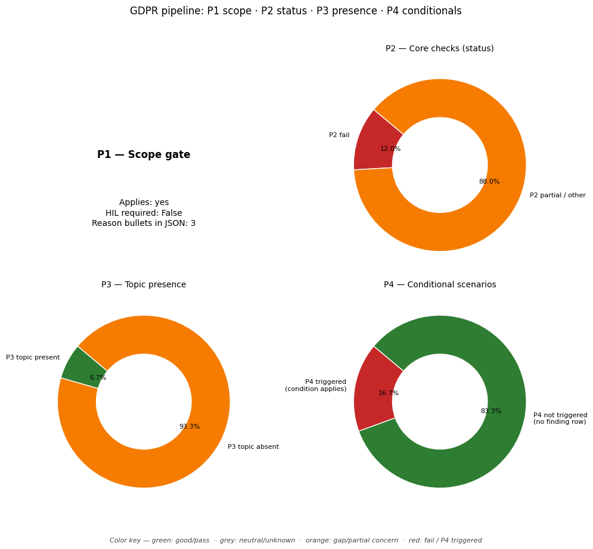

# GDPR Compliance Audit Report

**Target Document:** ../data/testing_files/md_files_post_gdpr/test5_linkedin.md

## Distribution chart (P1–P4)
*(P1 = scope gate in JSON `scope`; P2–P4 = `findings` by `priority`.)*

## Scope assessment (P1)
Applies: **yes**

HIL required at scope: **False**

### Scope reasons
- The company's services involve processing personal data of users.
- The company targets users in the Union by offering services to them.
- The company monitors user behavior within the Union.

## Executive summary
**Overall compliance score (P2-only index):** 44%

### Summary block (`summary` in JSON)
- **findings_total:** 41
- **hil_queue_total:** 16
- **overall_score_pct:** 44
- **p2_findings_total:** 25
- **p2_score:** 0.44
- **p3_findings_total:** 15
- **p4_articles_not_triggered:** 5
- **p4_triggered_total:** 1

### Counts used in the chart
- **P2:** total 25 — fail / partial / pass / other: 3 / 22 / 0 / 0
- **P3:** total 15 — topic present / absent / unknown: 1 / 14 / 0
- **P4:** triggered (summary) 1, triggered rows in `findings` 1, not triggered in scope 5
- **HIL queue items:** 16

## Findings breakdown (P2 / P3 / P4)

### Article 5: Principles relating to processing
- **Priority:** P2
- **Chapter:** Ch.2 – Principles
- **Risk level:** MEDIUM
- **Status:** PARTIAL

#### Identified gaps
* The policy does not explicitly address data minimization, ensuring that data collected is adequate, relevant, and limited to what is necessary for the stated purposes.
* The policy does not explicitly detail provisions for accurate data, including steps to rectify or erase inaccurate personal data without delay.
* The policy does not explicitly mention 'storage limitation', stating how long personal data is kept and under what conditions it can be retained for longer periods.
* The policy does not contain explicit statements on 'accountability', demonstrating how compliance with data protection principles is ensured and maintained.

_Notes:_ The policy addresses transparency by stating commitment to transparency and providing choices about data. It also touches upon purpose limitation by stating data is collected for services. However, it lacks explicit mentions of data minimization, accuracy, storage limitation, and accountability principles as outlined in Article 5. The policy also doesn't clearly state the specific purposes for data collection, only general uses related to the service. User control over data is mentioned, which implies some level of lawfulness and fairness, but these are not explicitly stated as principles.

---

### Article 6: Lawfulness of processing
- **Priority:** P2
- **Chapter:** Ch.2 – Principles
- **Risk level:** CRITICAL
- **Status:** FAIL

#### Identified gaps
* No lawful basis for processing has been stated in the provided policy text.

_Notes:_ The policy does not specify the lawful basis for processing personal data as required by GDPR Article 6. This is a critical gap.

---

### Article 7: Conditions for consent
- **Priority:** P2
- **Chapter:** Ch.2 – Principles
- **Risk level:** MEDIUM
- **Status:** PARTIAL

#### Identified gaps
* The policy does not explicitly state that consent requests must be clearly distinguishable from other matters in an intelligible and easily accessible form, using clear and plain language.
* The policy does not provide information on the mechanism for withdrawing consent, or state that it should be as easy to withdraw as to give consent.
* The policy does not address whether the performance of a contract is conditional on consent to processing of personal data not necessary for that contract, which is relevant for assessing if consent is freely given.

_Notes:_ The policy mentions that users have choices about the information they provide on their profile and that it is their choice whether to include sensitive information and make it public. It also states that users give other data by syncing their address book or calendar and that personal data is collected when users provide, post, or upload it to the services. However, the policy does not explicitly detail the conditions for consent as required by GDPR Article 7, specifically regarding the clarity of consent requests, the ease of withdrawal, and the conditionality of consent on contractual performance.

---

### Article 8: Child's consent
- **Priority:** P3
- **Chapter:** Ch.2 – Principles
- **Policy present:** False
- **Risk level:** NONE
- **Status:** N/A (P3/P4 OR UNSCORED)

_Notes:_ The policy does not contain any information regarding age verification mechanisms or parental consent for children's data processing. The provided text focuses on general data collection, usage, and sharing practices for adult users.

---

### Article 9: Special category data
- **Priority:** P2
- **Chapter:** Ch.2 – Principles
- **Risk level:** HIGH
- **Status:** PARTIAL

#### Identified gaps
* Explicit consent or Art.9(2) derogation for special category data processing is not explicitly stated.

_Notes:_ The policy mentions that it is the user's choice to include sensitive information on their profile and make it public. However, it does not specify the requirements for explicit consent or any of the derogations under Article 9(2) of the GDPR for processing such data, if it were to be processed. This could lead to non-compliance if special category data is processed without the necessary legal basis.

---

### Article 10: Criminal convictions data
- **Priority:** P3
- **Chapter:** Ch.2 – Principles
- **Policy present:** False
- **Risk level:** NONE
- **Status:** N/A (P3/P4 OR UNSCORED)

_Notes:_ The policy does not mention criminal convictions data.

---

### Article 11: Processing without identification
- **Priority:** P2
- **Chapter:** Ch.2 – Principles
- **Risk level:** LOW
- **Status:** PARTIAL

#### Identified gaps
* The policy does not explicitly state whether LinkedIn processes data without identification, nor does it detail procedures for cases where identification is not required or possible for specific processing purposes.

_Notes:_ The policy does not contain information relevant to Article 11 of the GDPR, which deals with processing without identification. Therefore, compliance cannot be fully assessed based on the provided text.

---

### Article 12: Transparency & modalities
- **Priority:** P2
- **Chapter:** Ch.3 – Rights of data subjects
- **Risk level:** CRITICAL
- **Status:** FAIL

#### Identified gaps
* Response time commitment
* Information provided free of charge

_Notes:_ The policy text does not contain information regarding the response time commitment for data subject requests, nor does it state that information provided will be free of charge. This is a critical risk because GDPR Article 12(3) mandates a response within one month, and Article 12(5) requires information to be provided free of charge unless requests are manifestly unfounded or excessive. The policy does mention notification and modification of the Privacy Policy when data collection or usage changes materially, which addresses transparency to some extent, but not the response modalities for data subject rights.

---

### Article 13: Info collected from data subject
- **Priority:** P2
- **Chapter:** Ch.3 – Rights of data subjects
- **Risk level:** HIGH
- **Status:** PARTIAL

#### Identified gaps
* Controller ID
* DPO contact details
* Legal basis for processing
* Data retention period
* Recipients of personal data
* Data subject rights summary
* Right to lodge a complaint with a supervisory authority
* Information about automated decision-making, including profiling

_Notes:_ The policy mentions that LinkedIn Ireland or LinkedIn Corporation will be the controller, but does not provide specific contact details for either. The DPO contact details are not mentioned. The legal basis for processing, data retention period, recipients of personal data, and a summary of data subject rights are not explicitly detailed in the provided text. The policy does not mention the right to lodge a complaint with a supervisory authority or information about automated decision-making, including profiling.

---

### Article 14: Info not obtained from data subject
- **Priority:** P2
- **Chapter:** Ch.3 – Rights of data subjects
- **Risk level:** HIGH
- **Status:** PARTIAL

#### Identified gaps
* The policy does not specify the identity and contact details of the controller and, where applicable, of the controller's representative.
* The policy does not specify the contact details of the data protection officer, where applicable.
* The policy does not specify the purposes of the processing for which the personal data are intended as well as the legal basis for the processing.
* The policy does not specify the categories of personal data concerned.
* The policy does not specify the recipients or categories of recipients of the personal data, if any.
* The policy does not specify where applicable, that the controller intends to transfer personal data to a recipient in a third country or international organisation and the existence or absence of an adequacy decision by the Commission, or in the case of transfers referred to in Article 46 or 47, or the second subparagraph of Article 49(1), reference to the appropriate or suitable safeguards and the means to obtain a copy of them or where they have been made available.
* The policy does not specify the period for which the personal data will be stored, or if that is not possible, the criteria used to determine that period.
* The policy does not specify where the processing is based on point (f) of Article 6(1), the legitimate interests pursued by the controller or by a third party.
* The policy does not specify the existence of the right to request from the controller access to and rectification or erasure of personal data or restriction of processing concerning the data subject and to object to processing as well as the right to data portability.
* The policy does not specify where processing is based on point (a) of Article 6(1) or point (a) of Article 9(2), the existence of the right to withdraw consent at any time, without affecting the lawfulness of processing based on consent before its withdrawal.
* The policy does not specify the right to lodge a complaint with a supervisory authority.
* The policy does not specify from which source the personal data originate, and if applicable, whether it came from publicly accessible sources.
* The policy does not specify the existence of automated decision-making, including profiling, referred to in Article 22(1) and (4) and, at least in those cases, meaningful information about the logic involved, as well as the significance and the envisaged consequences of such processing for the data subject.

_Notes:_ The policy mentions that data is collected through cookies and similar technologies, and that some data is provided by organizations (e.g., employers) for premium services. This indicates that personal data may not always be obtained directly from the data subject. However, the policy does not provide the specific information required by Article 14(1) and 14(2) of the GDPR for data obtained indirectly. Therefore, the status is partial.

---

### Article 15: Right of access
- **Priority:** P2
- **Chapter:** Ch.3 – Rights of data subjects
- **Risk level:** HIGH
- **Status:** PARTIAL

#### Identified gaps
* The policy does not describe the process for submitting a Subject Access Request (SAR).
* The policy does not specify the timeline for responding to SARs.
* The policy does not mention the process for identity verification for SARs.
* The policy does not detail what information will be provided as part of an SAR response.

_Notes:_ The policy mentions that users have choices about data collection and use, and that personal data is subject to the privacy policy. However, it does not explicitly describe the process for data subjects to exercise their right of access under GDPR Article 15, including the submission process, response timelines, identity verification, or the scope of information provided.

---

### Article 16: Right to rectification
- **Priority:** P2
- **Chapter:** Ch.3 – Rights of data subjects
- **Risk level:** MEDIUM
- **Status:** PARTIAL

#### Identified gaps
* The policy does not specify that rectification must be done 'without undue delay' or provide equivalent wording.

_Notes:_ The policy does not explicitly state that the right to rectification must be exercised 'without undue delay' or provide equivalent wording as required by GDPR Article 16. It is unclear if there is a defined timeframe for rectifying inaccurate personal data.

---

### Article 17: Right to erasure
- **Priority:** P2
- **Chapter:** Ch.3 – Rights of data subjects
- **Risk level:** HIGH
- **Status:** PARTIAL

#### Identified gaps
* The policy does not describe the process for handling deletion requests.
* The policy does not outline any grounds for refusal of deletion requests.
* The policy does not mention any exceptions to deletion, such as retention periods or legal obligations.

_Notes:_ The policy mentions that they collect data and use it for various purposes, but it does not provide any information on how data subjects can request the deletion of their personal data, nor does it specify the grounds for refusal or any exceptions to the right to erasure. This leaves a gap in the process for fulfilling Article 17 requests.

---

### Article 18: Right to restriction
- **Priority:** P2
- **Chapter:** Ch.3 – Rights of data subjects
- **Risk level:** MEDIUM
- **Status:** PARTIAL

#### Identified gaps
* The policy does not explicitly describe the right to restriction of processing, such as what happens when the accuracy of personal data is contested, processing is unlawful, data is no longer needed by the controller but required by the data subject for legal claims, or when a data subject has objected to processing pending verification of legitimate grounds.

_Notes:_ The policy does not explicitly describe the right to restriction of processing. It is unclear if the company has mechanisms in place to handle requests for restriction of processing under the various conditions outlined in GDPR Article 18.

---

### Article 19: Notification on rectification/erasure
- **Priority:** P3
- **Chapter:** Ch.3 – Rights of data subjects
- **Policy present:** False
- **Risk level:** NONE
- **Status:** N/A (P3/P4 OR UNSCORED)

_Notes:_ The policy does not mention downstream notification to recipients in the context of rectification or erasure.

---

### Article 20: Right to data portability
- **Priority:** P2
- **Chapter:** Ch.3 – Rights of data subjects
- **Risk level:** MEDIUM
- **Status:** PARTIAL

#### Identified gaps
* The policy does not explicitly mention the right to receive personal data in a structured, commonly used and machine-readable format.
* The policy does not explicitly mention the right to transmit data to another controller without hindrance.
* The policy does not explicitly mention the right to have data transmitted directly from one controller to another where technically feasible.

_Notes:_ The policy does not contain any information regarding the right to data portability, including the structured/machine-readable format or the controller-to-controller transfer right. Further information is required to assess compliance.

---

### Article 21: Right to object
- **Priority:** P2
- **Chapter:** Ch.3 – Rights of data subjects
- **Risk level:** MEDIUM
- **Status:** PARTIAL

#### Identified gaps
* Policy does not explicitly state how users can object to profiling or direct marketing. It mentions 'opt out' from certain tracking and ad targeting but lacks specifics on the objection right for direct marketing and profiling.

_Notes:_ The policy mentions 'opt out' mechanisms for tracking and ad targeting, which can be related to direct marketing and profiling. However, it does not explicitly detail the right to object to processing based on Article 6(1)(e) or (f), nor does it clearly outline the process for objecting to direct marketing and profiling as required by Article 21. The link 'For Visitors, the controls are here' might contain the relevant information, but it's not included in the provided text, hence the 'partial' status.

---

### Article 22: Automated decision-making
- **Priority:** P2
- **Chapter:** Ch.3 – Rights of data subjects
- **Risk level:** HIGH
- **Status:** PARTIAL

#### Identified gaps
* The policy does not state whether individuals have the right not to be subject to automated decision-making, including profiling, that produces legal effects or similarly significant effects.
* The policy does not specify the conditions under which automated decision-making may be used (e.g., contract necessity, legal authorization, or explicit consent).
* The policy does not outline the measures in place to safeguard the rights and freedoms of individuals when automated decision-making is used, particularly regarding the right to human intervention, expressing a point of view, and contesting a decision.

_Notes:_ The policy mentions the use of automated systems and inferences to personalize services and ads. However, it does not address Article 22 requirements regarding the right not to be subject to automated decision-making, the conditions for such processing, or the safeguards for individual rights like human intervention and the right to contest decisions. Further information is needed to assess compliance.

---

### Article 24: Responsibility of the controller
- **Priority:** P2
- **Chapter:** Ch.4 – Controller & processor
- **Risk level:** MEDIUM
- **Status:** PARTIAL

#### Identified gaps
* The policy does not explicitly mention the implementation of data protection policies as required by Article 24(2).
* There is no clear indication of how the company reviews and updates its technical and organisational measures to ensure and demonstrate compliance with data protection regulations, as mandated by Article 24(1).

_Notes:_ The policy demonstrates some technical and organisational measures for data processing, such as using cookies, device information, and IP addresses, and obtaining consent for precise location data. It also mentions improving services and notifying users of material changes in data collection or usage. However, it does not explicitly detail a policy for data protection or a structured process for reviewing and updating security measures to ensure ongoing compliance and demonstrate accountability as required by GDPR Article 24. Therefore, the status is partial.

---

### Article 25: Privacy by design and default
- **Priority:** P3
- **Chapter:** Ch.4 – Controller & processor
- **Policy present:** False
- **Risk level:** NONE
- **Status:** N/A (P3/P4 OR UNSCORED)

---

### Article 26: Joint controllers
- **Priority:** P3
- **Chapter:** Ch.4 – Controller & processor
- **Policy present:** False
- **Risk level:** NONE
- **Status:** N/A (P3/P4 OR UNSCORED)

_Notes:_ The policy mentions controllers but not joint controllership.

---

### Article 27: Representatives (non-EU)
- **Priority:** P3
- **Chapter:** Ch.4 – Controller & processor
- **Policy present:** False
- **Risk level:** NONE
- **Status:** N/A (P3/P4 OR UNSCORED)

_Notes:_ The policy excerpt does not contain information regarding the appointment of a representative for data processing activities for entities outside the EU, which is the subject of GDPR Article 27.

---

### Article 28: Processor / DPA
- **Priority:** P2
- **Chapter:** Ch.4 – Controller & processor
- **Risk level:** HIGH
- **Status:** PARTIAL

#### Identified gaps
* Sub-processor list
* Audit rights
* Deletion/return obligation
* Written instructions

_Notes:_ The provided company policy does not contain information regarding Data Processing Agreements (DPAs) or specific clauses like sub-processor lists, audit rights, deletion/return obligations, or written instructions, which are key requirements under GDPR Article 28. Therefore, compliance cannot be fully verified with the current information.

---

### Article 29: Processing under authority
- **Priority:** P2
- **Chapter:** Ch.4 – Controller & processor
- **Risk level:** LOW
- **Status:** PARTIAL

#### Identified gaps
* No information in the policy excerpt details how instruction chains are documented, specifically concerning persons acting under the authority of the controller or processor who have access to personal data and how they are instructed on processing limitations, unless required by law.

_Notes:_ The policy excerpt does not contain specific details regarding the documentation of instruction chains for individuals processing personal data under the authority of the controller or processor. Therefore, compliance with Article 29 of the GDPR cannot be fully verified based on the provided text.

---

### Article 30: Records of processing (ROPA)
- **Priority:** P2
- **Chapter:** Ch.4 – Controller & processor
- **Risk level:** MEDIUM
- **Status:** PARTIAL

#### Identified gaps
* The policy does not explicitly state the existence of a ROPA, nor does it detail its contents for purposes, categories of data subjects, categories of recipients, retention periods, or security measures.

_Notes:_ The provided policy text describes various data collection and usage practices, including the types of data collected (e.g., IP addresses, device information, cookies, message content, data from third-party services) and some of the purposes for processing (e.g., personalization, ad relevance, service improvement, facilitating connections). However, it does not explicitly confirm the existence of a formal Record of Processing Activities (ROPA) as required by GDPR Article 30. Furthermore, specific details regarding the categories of data subjects, explicit retention periods for different data types, and a general description of technical and organizational security measures are not clearly stated in the provided text. Therefore, the compliance is partial.

---

### Article 32: Security of processing
- **Priority:** P3
- **Chapter:** Ch.4 – Controller & processor
- **Policy present:** True
- **Risk level:** NONE
- **Status:** N/A (P3/P4 OR UNSCORED)

---

### Article 33: Breach notification to SA
- **Priority:** P3
- **Chapter:** Ch.4 – Controller & processor
- **Policy present:** False
- **Risk level:** NONE
- **Status:** N/A (P3/P4 OR UNSCORED)

_Notes:_ The policy does not contain information on breach notification procedures, DPO contact details, or operational breach logs. It focuses on data collection and usage practices.

---

### Article 34: Breach communication to data subject
- **Priority:** P3
- **Chapter:** Ch.4 – Controller & processor
- **Policy present:** False
- **Risk level:** NONE
- **Status:** N/A (P3/P4 OR UNSCORED)

_Notes:_ The policy does not contain any information about procedures or notifications related to data breaches or communication with data subjects in the event of a breach. The provided text focuses on data collection, usage, and sharing practices.

---

### Article 35: DPIA
- **Priority:** P3
- **Chapter:** Ch.4 – Controller & processor
- **Policy present:** False
- **Risk level:** NONE
- **Status:** N/A (P3/P4 OR UNSCORED)

_Notes:_ The provided text does not mention Data Protection Impact Assessments (DPIAs) or related concepts. It focuses on data collection, usage, sharing, and user controls.

---

### Article 37: DPO designation
- **Priority:** P2
- **Chapter:** Ch.4 – Controller & processor
- **Risk level:** MEDIUM
- **Status:** PARTIAL

#### Identified gaps
* The company policy does not specify whether the processing of personal data requires regular and systematic monitoring of data subjects on a large scale or if it involves the processing of special categories of data or data relating to criminal convictions.
* The company policy does not provide contact details for a Data Protection Officer (DPO).

_Notes:_ The policy does not provide sufficient information to determine if a DPO is required under Article 37(1)(b) or (c), nor does it provide the contact details for a DPO as required by Article 37(7). The nature of LinkedIn's services (social network for professionals) suggests it might engage in large-scale monitoring or processing of special categories of data, but this is not explicitly stated or detailed in the provided text.

---

### Article 38: DPO position
- **Priority:** P3
- **Chapter:** Ch.4 – Controller & processor
- **Policy present:** False
- **Risk level:** NONE
- **Status:** N/A (P3/P4 OR UNSCORED)

_Notes:_ The provided text does not contain any information regarding the position or independence of a Data Protection Officer (DPO) or similar roles. Therefore, it does not materially mention or address the topics covered by GDPR Article 38.

---

### Article 39: DPO tasks
- **Priority:** P2
- **Chapter:** Ch.4 – Controller & processor
- **Risk level:** HIGH
- **Status:** PARTIAL

#### Identified gaps
* The policy does not detail the specific tasks of the Data Protection Officer (DPO) regarding advising on data protection obligations, monitoring compliance, involvement in Data Protection Impact Assessments (DPIAs), or cooperation with supervisory authorities. It is unclear if these core DPO responsibilities are formally assigned and documented.
* There is no mention of how the DPO monitors compliance with data protection regulations, including staff training, awareness-raising, or conducting audits.
* The policy does not specify the DPO's role or involvement in Data Protection Impact Assessments (DPIAs).
* There is no information regarding the DPO's responsibility to cooperate with supervisory authorities.

_Notes:_ The provided policy text does not contain specific information about the Data Protection Officer's tasks as required by Article 39 of the GDPR. Therefore, it is not possible to verify if the DPO mandate covers advising on obligations, monitoring compliance, DPIA involvement, or cooperation with supervisory authorities. Additional policy documentation is required to assess these aspects.

---

### Article 40: Codes of conduct
- **Priority:** P3
- **Chapter:** Ch.4 – Controller & processor
- **Policy present:** False
- **Risk level:** NONE
- **Status:** N/A (P3/P4 OR UNSCORED)

_Notes:_ The provided policy text does not contain any information about codes of conduct or adherence to them. The text focuses on LinkedIn's privacy policy, data collection, usage, and sharing practices.

---

### Article 42: Certification
- **Priority:** P3
- **Chapter:** Ch.4 – Controller & processor
- **Policy present:** False
- **Risk level:** NONE
- **Status:** N/A (P3/P4 OR UNSCORED)

_Notes:_ The provided policy text does not mention certification, GDPR Article 42, or any related concepts like certification bodies, certification mechanisms, or data protection seals. Therefore, the topic is not addressed.

---

### Article 44: General principle for transfers
- **Priority:** P2
- **Chapter:** Ch.5 – Transfers to third countries
- **Risk level:** CRITICAL
- **Status:** PARTIAL

#### Identified gaps
* The policy does not specify the mechanisms used for international data transfers as required by Chapter V of the GDPR.

_Notes:_ The policy does not contain any information regarding international data transfers or the mechanisms used to ensure compliance with Chapter V of the GDPR. Therefore, compliance cannot be verified.

---

### Article 45: Adequacy decision transfers
- **Priority:** P2
- **Chapter:** Ch.5 – Transfers to third countries
- **Risk level:** MEDIUM
- **Status:** PARTIAL

#### Identified gaps
* The policy does not specify if LinkedIn has conducted an adequacy assessment for any countries it transfers data to, nor does it mention any specific mechanisms like Standard Contractual Clauses or Binding Corporate Rules.

_Notes:_ The policy mentions "Designated Countries" which are EU, EEA, and Switzerland. However, it does not provide information on adequacy decisions as required by Article 45, nor does it mention any other transfer mechanisms for data transfers outside these areas. Therefore, the assessment is partial.

---

### Article 46: Transfers with safeguards
- **Priority:** P3
- **Chapter:** Ch.5 – Transfers to third countries
- **Policy present:** False
- **Risk level:** NONE
- **Status:** N/A (P3/P4 OR UNSCORED)

_Notes:_ The provided text does not mention Standard Contractual Clauses (SCCs), Binding Corporate Rules (BCRs), or any other safeguards related to international data transfers, which are the core topics of Article 46 of the GDPR. The text focuses on data collection, usage, and sharing within the service and with third-party advertisers and partners, but not on the specific legal mechanisms for safeguarding data during international transfers.

---

### Article 47: Binding corporate rules
- **Priority:** P3
- **Chapter:** Ch.5 – Transfers to third countries
- **Policy present:** False
- **Risk level:** NONE
- **Status:** N/A (P3/P4 OR UNSCORED)

_Notes:_ The policy does not mention Binding Corporate Rules (BCR) or any related concepts.

---

### Article 77: Right to lodge a complaint
- **Priority:** P2
- **Chapter:** Ch.8 – Remedies, liability & penalties
- **Risk level:** HIGH
- **Status:** FAIL

#### Identified gaps
* Policy does not inform data subjects of their right to lodge a complaint with a supervisory authority.
* Policy does not inform data subjects of how to lodge a complaint with a supervisory authority.

_Notes:_ The policy does not contain any information regarding the data subject's right to lodge a complaint with a supervisory authority, nor does it provide any information on how to do so. This directly impacts the data subject's ability to exercise their rights under GDPR Article 77.

---

### Article 88: Employment context
- **Priority:** P2
- **Chapter:** Ch.9 – Specific processing situations
- **Risk level:** MEDIUM
- **Status:** PARTIAL

#### Identified gaps
* Recruitment
* Performance of the contract of employment
* Health and safety data
* Termination of the employment relationship

_Notes:_ The policy mentions using data for career opportunities, job recommendations, and searching for candidates, which touches on recruitment and talent management. However, it does not explicitly cover other aspects of the employment context such as performance of employment contract, health and safety, or termination of employment. Therefore, the policy is only partially compliant.

---

### Article 90: Obligations of secrecy
- **Priority:** P4
- **Chapter:** Ch.9 – Specific processing situations
- **P4 triggered:** True
- **What to review:** ['Verify if specific national laws mandate archiving of communications for financial advisors.', "Confirm if LinkedIn's service facilitates this archival in a way that implicates legal or professional secrecy obligations.", 'Assess if the processing described aligns with exemptions related to professional secrecy under Article 90.']
- **Risk level:** NONE
- **Status:** N/A (P3/P4 OR UNSCORED)

_Notes:_ The policy mentions 'legal or professional compliance' and provides an example of a 'financial advisor' needing to 'archive communications... in order to maintain her professional financial advisor license', which aligns with the professional secrecy aspect of Article 90.

---

## Human-in-the-loop (HIL) review queue

**1. Article 8: Child's consent**
- Type: p3_verify
- Notes: The policy does not contain any information regarding age verification mechanisms or parental consent for children's data processing. The provided text focuses on general data collection, usage, and sharing practices for adult users.

**2. Article 10: Criminal convictions data**
- Type: p3_verify
- Notes: The policy does not mention criminal convictions data.

**3. Article 19: Notification on rectification/erasure**
- Type: p3_verify
- Notes: The policy does not mention downstream notification to recipients in the context of rectification or erasure.

**4. Article 25: Privacy by design and default**
- Type: p3_verify
- Notes: None

**5. Article 26: Joint controllers**
- Type: p3_verify
- Notes: The policy mentions controllers but not joint controllership.

**6. Article 27: Representatives (non-EU)**
- Type: p3_verify
- Notes: The policy excerpt does not contain information regarding the appointment of a representative for data processing activities for entities outside the EU, which is the subject of GDPR Article 27.

**7. Article 32: Security of processing**
- Type: p3_verify
- Notes: None

**8. Article 33: Breach notification to SA**
- Type: p3_verify
- Notes: The policy does not contain information on breach notification procedures, DPO contact details, or operational breach logs. It focuses on data collection and usage practices.

**9. Article 34: Breach communication to data subject**
- Type: p3_verify
- Notes: The policy does not contain any information about procedures or notifications related to data breaches or communication with data subjects in the event of a breach. The provided text focuses on data collection, usage, and sharing practices.

**10. Article 35: DPIA**
- Type: p3_verify
- Notes: The provided text does not mention Data Protection Impact Assessments (DPIAs) or related concepts. It focuses on data collection, usage, sharing, and user controls.

**11. Article 38: DPO position**
- Type: p3_verify
- Notes: The provided text does not contain any information regarding the position or independence of a Data Protection Officer (DPO) or similar roles. Therefore, it does not materially mention or address the topics covered by GDPR Article 38.

**12. Article 40: Codes of conduct**
- Type: p3_verify
- Notes: The provided policy text does not contain any information about codes of conduct or adherence to them. The text focuses on LinkedIn's privacy policy, data collection, usage, and sharing practices.

**13. Article 42: Certification**
- Type: p3_verify
- Notes: The provided policy text does not mention certification, GDPR Article 42, or any related concepts like certification bodies, certification mechanisms, or data protection seals. Therefore, the topic is not addressed.

**14. Article 46: Transfers with safeguards**
- Type: p3_verify
- Notes: The provided text does not mention Standard Contractual Clauses (SCCs), Binding Corporate Rules (BCRs), or any other safeguards related to international data transfers, which are the core topics of Article 46 of the GDPR. The text focuses on data collection, usage, and sharing within the service and with third-party advertisers and partners, but not on the specific legal mechanisms for safeguarding data during international transfers.

**15. Article 47: Binding corporate rules**
- Type: p3_verify
- Notes: The policy does not mention Binding Corporate Rules (BCR) or any related concepts.

**16. Article 90: Obligations of secrecy**
- Type: p4_conditional
- Notes: The policy mentions 'legal or professional compliance' and provides an example of a 'financial advisor' needing to 'archive communications... in order to maintain her professional financial advisor license', which aligns with the professional secrecy aspect of Article 90.

